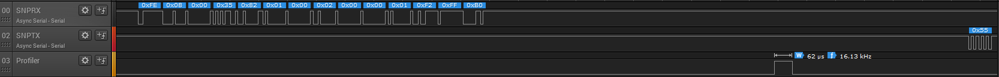
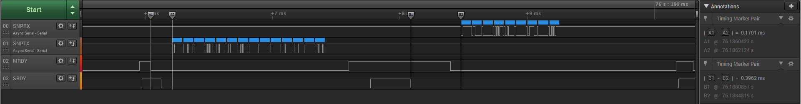
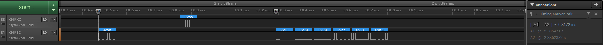

Unified NPI with UART Software Handshaking
=========================================

[Bluetooth Low Energy Main Wiki Page](http://processors.wiki.ti.com/index.php/Category:BluetoothLE)

### Introduction

This guide explains a two wire UART implementation of the TI's Unified Network Processor Interface(uNPI) with support for power management. Using a two wire interface is advantageous because it frees up GPIO pins on the CC2640 and any other processors in the design. Software handshaking allows both processors to sleep when idle, thus minimizing the power consumption. For brevity, this example code will also be referred to as Two wire uNPI.

The two wire UART functionality is demoed using modified versions of the SimpleAP and SimpleNP projects from TI's BLE SDK. These projects were selected because they already rely on uNPI, but this functionality can be added to any application.

### Definitions
Before getting started, let's review some terms and concepts that will be used throughout this wiki.

|               Term (acronym)               |                                                                                                                  Definition                                                                                                                  |
|:------------------------------------------:|:--------------------------------------------------------------------------------------------------------------------------------------------------------------------------------------------------------------------------------------------:|
| Unified Network Processor Interface (uNPI) |                                                          NPI is a serial communication protocol developed by TI. It is the foundation of our BLE Network Processor implementations                                                           |
|           Power Management (PM)            |                                                                              Refers to when the CC2640 device is allowed to enter into a low power sleep mode.                                                                               |
|                Handshaking                 |                            A design paradigm in communication protocols where each transaction is preceded by an a request from the initiating processor and acknowledge from receiving processor (a handshake).                             |
|            Master Ready (MRDY)             | A GPIO pin whose logic level indicates the state of the master processor. MRDY is an active low (low true) signal. An MRDY event indicates that the master processor is ready to send or receive data. See NPI timing diagrams for more info |
|             Slave Ready (SRDY)             |                     A GPIO pin whose logic level indicates the state of the slave processor. SRDY is an active low (low true) signal. An SRDY event indicates that the slave processor is ready to send or receive data.                     |
|         Software Handshake (SWHS)          |                                                                                     Performing a handshake as described above using an exchange of bytes                                                                                     |
|              local processor               |                                                                  The processor whose role is currently being examined. TX and RX directions always refer to the local proc                                                                   |
|              remote processor              |                                                                                       The processor that is connected to the local processor via UART                                                                                        |
|                   Chirp                    |                                              A meaningless byte that is swapped between local and remote processors to perform a software handshake and wake up the remote processor if needed                                               |


### Prerequisites
* Download the code form this Github repo
* Download and install latest BLE stack release (BLE Stack v2.1 at the time of this writing)
* Supported Version of IAR or CCS
* Two Wire NPI is based on the Unified NPI protocol, which is described in depth here: [Unified NPI](http://processors.wiki.ti.com/index.php/Unified_Network_Processor_Interface)
 * It is stongly recommended that the user read the above link before using the two wire UART uNPI demo
* There is also a wiki on the SimpleAP and SNP projects: [SimpleAP + SimpleNP Demo](http://processors.wiki.ti.com/index.php/SimpleAP%2BSNP)


### Comparison with uNPI

As mentioned earlier this sample code is based on TI's Unified Network Processor Interface. There are a few differences between this example and standard uNPI code.

* Two Wire uNPI only supports UART, the SPI peripheral require hardware handshaking on the CC2640
* There is no set NPI role in Two Wire uNPI, iniator/responder is determined on a per frame basis
* There is a latency associated with the software handshake

### Software Handshaking Overview
At a high level, this code aims to replace the MRDY and SRDY lines with an exchange of bytes. In order to wake the CC2640 from sleep on the reception of a byte a few steps must be taken before sleeping.
1. Close the UART peripheral,
2. Open the the UART pin as a GPIO, set pin interrupts
3. Release power management constraints

The devices are now safe to sleep. When the local processor wants to wake the remote, it simply needs to perform a software handshake. This process is detailed below:

1. Remote processor receives a chirp byte
2. Chirp Byte triggers remote processor pin ISR
3. ISR signals NPI task to close UART RX GPIO pin and open the UART module
4. Once the UART module is open, remote processor sends a chirp back to the AP to acknowledge that it is now awake
5. Now safe to send meaningful data

### Two Wire uNPI Roles
Traditionally uNPI assigns each processor a static role. A processor can be master or slave. Since Two Wire uNPI doesn't use the MRDY and SRDY lines, the roles can be assigned on a per transaction basis.

**Basics**
* The HS_INITIATOR is the processor who needs to send data to it's remote processor
* The HS_RESPONDER is the processor who wakes up on reception of a chirp and reads what the initiator is sending

**Race Conditions/Bidirectional Transfers**
Like uNPI, there are race conditions inherent to this communication scheme. Instead of requiring intricate race condition handling, two wire uNPI allows either processor to send data once a handshake is complete.

This makes race condition handling easier, each processor simply reads before sending data. After its transmit is complete, it checks to be sure a RX is not ongoing before triggering it's callback.

### Handling the Critical Section
**Profiling the Critical Section**
The critical section is the time between closing the UART peripheral and readying the GPIO for pin interrupts.

If remote processor were to send a chirp when the local processor was between closing the UART and opening the GPIO the chip would be missed. This example has a feature that allows the critical section to be profiled using a spare GPIO pin. LED1 on the SmartRF06 board was selected.

The profiler may be enabled by defining SWHS_DEBUG in the preprocessor symbols.

The critical section was profiled and found to be ~62us.

**Chirp Timeout**
In order to handle the risks inherent to the above critical section, two wire uNPI has implemented a chirp timeout feature. If a chirp is missed by the remote processor, the local processor will continue to send chirps until the local processor responds.

The chirp timeout is handled using a TI-RTOS clock that is constructed when the task is initialized and started and stopped with each handshake. When a handshake is started, the initiating processor starts the clock. When the handshake is complete the clock is stopped. If the clock times out before the handshake is completed the initiating processor will assume that the remote processor has lost the chirp and will send another.

The RTOS clock that controls the chirp timeout has a programmable period. By default the period is set to 0.5s. This is much more time than what is required to complete a handshake. The clock's period can be changed by changing the define

```C
#define NPI_SWHS_CHIRP_TIMEOUT_PERIOD       500
```
The above define is increments of ms. This value should be trimmed down lower the total time required to send data in the case of a missed chirp.

### Profiling the Latency

Software handshaking is inherently slower than hardware handshaking, because each frame has the overhead of sending data over the UART to keep both processors in sync before sending the actual data.
The above software handshaking is also slower than the hardware handshaking equivalent. We have provided two logic captures below to give an idea of typical latency numbers for software vs hardware handshaking.
It is important to remember that these are just typical measurements, as the latency depends on processor load, and other factors.



### Handshaking data

Various bytes will need to be sent over the UART lines in order to keep both processors in sync. They are summarized in the table

| Name    | Value |
|:--------------------------------------------------------------------------------------------------------------------------------:|:---------------:|
|                                                            Chirp byte                                                            |      0x55       |
|                                                            Reset Byte                                                            |      0xFA       |
|                                                            Junk byte                                                             |      0xAA       |


The chirp byte is used to perform the software handshake. An exchange of chirps between local and remote processors completes a software handshake and ensures the processors are in sync.

In order to prevent either processor from entering a bad state, reset logic has been built into the two wire uNPI code. If either processor sends a reset byte, the NPI bus is blocked until a reset handshake and a regular handshake are complete. This prevents an unexpected byte from locking up the communication, and allows a way for either processor to signal that they are in an unknown state.

The junk byte is what the handshaking data is initialized to before sending. This should never be sent.

**UART uNPI with Hardware Handshaking (MRDY/SRDY)**

Latency observed to be between ~67us to ~400us, with more samples showing a latency near ~390us as shown in the capture below.


**Two Wire UART uNPI with Software Handshaking**

Latency is observed to be ~800us. It is important remember that when using the supplied python script, the latency will be much higher. This has to do with a number of factors. In order to properly assess the latency of this solution connect another MCU to the SNP. See the capture below.


### Demo Instructions
The two wire UART uNPI features are demoed using the SimpleAP and SimpleNP projects from the TI BLE SDK. The SAPLib project is also needed, because the SimpleAP projects depends on it for it's uNPI functionality.
More information can be found at this wiki which explains the SimpleAP and SimpleNP using regular uNPI.
[SimpleAP + SimpleNP Demo](http://processors.wiki.ti.com/index.php/SimpleAP%2BSNP)

#### Required hardware:
* 2x SmartRF06 boards
* 3x Jumper wires
* (optional) logic analyzer
* coming soon: CC2650 lauchpad board support

#### Connecting the demo

The below table shows the pins needed for the demo on the SmartRF06 board.

| Signal name  | Pin location |
|:---------------:|:-------------------------------------------------------------------------------------------:|
|     UART RX     |                                           P408-12                                           |
|     UART TX     |                                           P408-14                                           |
|  Profiling pin  |                                           P405-4                                            |


Connect the UART TX of one processor to the UART RX pin of the other. Optionally a logic analyzer may be connected to the RX, TX and profiling pin to observe the communication protocol

#### Compiling the code

To build the two wire uNPI demo follow the below steps:
1. Clone the code in this github repo
2. Build the SAPLib using the sap_lib_sw_handshaking project
3. Build the SimpleAP using the simple_ap_sw_handshaking project, this will link to the above library
4. Load the SimpleAP image onto one SmartRF06 board
6. Build and load both the SimpleNP and SimpleNP Stack projects on the other SmartRF06 board

#### Using the demo

The AP should initialize the NP and display its BDADDR on the LCD screen, along with an indication that it is advertising. The NP can be connected to normally.

'''Note: This example uses the application layer source files from the SimpleNP and SimpleAP project within from the SDK. Note that changing these files will change the files in your SDK. NPI related files are stored as a copy within the /Components directory of this example.'''
