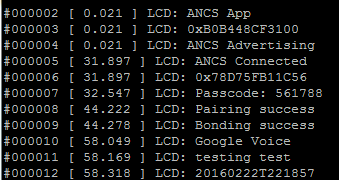
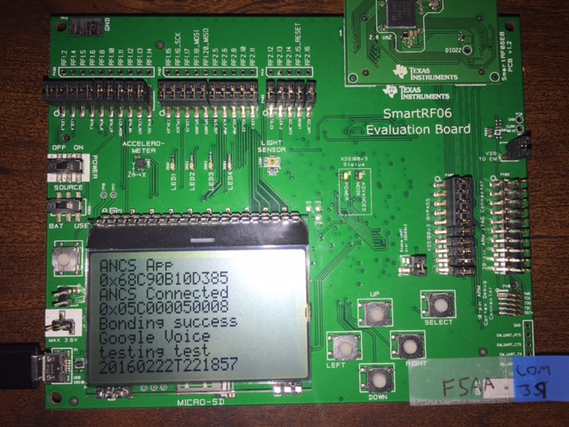

Apple Notification Center Service (ANCS)
====================
### Disclaimer
This example is still under construction. It has been tested and is confirmed to work under the nominal use cases. Other cases may have not be tested. Code in the ancs_client.c file still needs cleanup. Please file any bugs through the github issue tracking system.


### Purpose
The purpose of this project is to demonstrate a sample implementation of a CC2640/CC2650 based Apple Notification Center Service (ANCS) client. In addition, this sample application will give the user tips on how to connect to an iOS device using the TI BLE-Stack. The demo is simple, it will print the most recent notification to the screen or terminal and will allow the user to positive or negative action on the notification using button presses.  

### Prerequisities
It is expected that ther user of this demo has:
 - Read the Apple Bluetooth Accessory Design Guide. [Apple Bluetooth Accessory Design Guidelines](https://developer.apple.com/hardwaredrivers/BluetoothDesignGuidelines.pdf)
 - Read the ANCS spec. [ANCS Spec](https://developer.apple.com/library/ios/documentation/CoreBluetooth/Reference/AppleNotificationCenterServiceSpecification/Introduction/Introduction.html)
  - Note that all terminology from the ANCS spec will apply, from here on out, this page will use the ANCS terminology.

###### Hardware
This demo supports the following hardware:
- SmartRF06 Board + CC2650EM-7ID
- CC2650 LaunchPad.
The user must have one of these devices for out of the box support. However, with some effort this project can be ported to any device with two buttons, two LEDs, and a UART port such as the SensorTag. See the below page for TI development kits.
[TI Development Tools](http://processors.wiki.ti.com/index.php/CC13xx_CC26xx_Tools_Overview)

###### Software
This demo requires the latest BLE-Stack software which is v2.1.1 at the time of this writing. You can download this at here [TI BLE Stack](ti.com/ble-stack)

### ANCS overview
The purpose of ANCS is to give BLE accessories a simple and convenient way to access many kinds of notifications that are generated on iOS devices, like incoming calls, missing calls, new emails, etc.

**In order to consume ANCS notifications, the accessory must be a peripheral device that implements the GATT client.**

This means that the iOS implements the GATT server, and the data it is providing will be the notifications.

### ANCS Spec Summary
The ANCS spec document should be referenced at all times, this is only a short summary of the information contained at the
[ANCS Spec](https://developer.apple.com/library/ios/documentation/CoreBluetooth/Reference/AppleNotificationCenterServiceSpecification/Introduction/Introduction.html)

There are three key characteristics to ANCS:
* Notification Source: UUID: 9FBF120D-6301-42D9-8C58-25E699A21DBD (notifiable)
* Control Point:       UUID: 69D1D8F3-45E1-49A8-9821-9BBDFDAAD9D9 (writeable with response)
* Data Source:         UUID: 22EAC6E9-24D6-4BB5-BE44-B36ACE7C7BFB (notifiable)

###### Notification Source
This is a notify only characteristic in which the NP will use to inform the NC about noticications being added, removed, or updated. The NC must support this servce. Our sample app caches notification UIDs see on this characteristic and uses the control point characteristic to gain more data about them.

###### Control Point
This sample app uses the control point to write commands to the NP regarding notifications. Some example commands are getting more info about a notification or the app that provided it, and taking positive or negative action. Writes to the control point will optionally trigger a data response on the data source characteristic.

###### Control Point
This sample app uses notification data from this characteristic to populate the user's display.

###### Service Soliciation
This demo does not require the user to write any iOS application code, instead the user may connect, pair, and bond the Notification Consumer (NC) device using the iOS settings menu. However, 3rd party apps such as LightBlue can be used to initiate the connection.

Generally BLE devices do not appear in the iOS settings menu. However, soliciting a service from the iOS device will cause it to appear in the settings menu. See section 3.11.4 of Apple Bluetooth Accessory Design Guidelines for details. In this case, we will solicit the ANCS service by including the service solicitation flag in addition to the 128bit ANCS UUID in our advertisement data. See the code snippet below

```c
static uint8_t AncsApp_advData[] =
{
  // Flags; this sets the device to use limited discoverable
  // mode (advertises for 30 seconds at a time) instead of general
  // discoverable mode (advertises indefinitely)
  0x02, // length of this data  
  GAP_ADTYPE_FLAGS,
  GAP_ADTYPE_FLAGS_GENERAL | GAP_ADTYPE_FLAGS_BREDR_NOT_SUPPORTED,
  // Service Solicitation: this peripheral (NC) is looking for the ANCS service
  // on the iOS device. As per Apple Bluetooth Design Guidelines, soliciting
  // the ANCS service will cause the device to show up in the iOS settings app
  0x11, // length of this data
  GAP_ADTYPE_SERVICES_LIST_128BIT,
  // ANCS service UUID
  ANCS_SVC_UUID
};
```

The ANCS service UUIDs is 7905F431-B5CE-4E99-A40F-4B1E122D00D0, this and other necessary information can be found in the ANCS spec.

###### Pairing and Bonding
As per the ANCS spec, all characteristics of the ANCS service require authorization. This requires the NC to pair (and optionally bond) to the iOS device before meaningful notification data can be shared. From the Apple Bluetooth Accessory Design Guidelines guide section 3.9:
> "The accessory should not request pairing until an ATT request is rejected using the Insufficient Authentication
> error code. See the Bluetooth 4.0 specification, Volume 3, Part F, Section 4 for details.
> ...
> Similarly, if the iOS device acts as a Central and a GATT server, it may reject an ATT request using the Insufficient
> Authentication error code. The accessory should initiate the security procedure for pairing in response"

In the case of this sample application the NC implemnents the GATT client, so we must wait for the iOS device to reject a GATT transaction with insufficient authentication before starting the pairing process. See the code snippet below:

 ```c
  //ANCS requires authentication, if the NP attempts to read/write chars on the
  //NP without proper authentication, the NP will respond with insufficent_athen
  //error to which we must respond with a slave security request
  else if  (pMsg->method == ATT_ERROR_RSP &&
            pMsg->msg.errorRsp.reqOpcode == ATT_WRITE_REQ &&
            pMsg->msg.errorRsp.errCode == ATT_ERR_INSUFFICIENT_AUTHEN)
  {
    uint16 conn_handle;
    GAPRole_GetParameter(GAPROLE_CONNHANDLE, &conn_handle);
    uint8_t mitm;
    uint8_t bonding;
    GAPBondMgr_GetParameter(GAPBOND_MITM_PROTECTION, &mitm);
    GAPBondMgr_GetParameter(GAPBOND_BONDING_ENABLED, &bonding);
    uint8_t authRequest = ((mitm & 0x01) << 2) | ((bonding & 0x01) << 1) |
                          (bonding & 0x01);

    GAP_SendSlaveSecurityRequest(conn_handle, authRequest);
  }
```

### Running the Demo
There are two build configurations that ship with this sample app. One for the SmartRF06(SRF06) + CC2650EM-7ID and one for the CC2650 LaunchPad.

1. Please select right configuration for your development platform:
 * CC2640App - FlashROM --> This is the LaunchPad config
 * CC2640App - FlashROM_SRF06 --> This is the SmartRF06 + EM config

2. Once the target hardware has been selected, connect it via USB cable and build the BLE-Stack project and load it onto the device
>* Note that the SmartRF06 uses an XDS100v3 debugger where the CC2650 LaunchPad uses an XDS110, note you may  > need to switch the debugger to match your hardware*

3. Build the application project (using appropriate build config and debugger) and load it onto your development hardware

4. (LaunchPad Only) Since the LaunchPad doesn't have an LCD present, this project will use a UART logger to implement display functionality. In order to view these UART messages, you will need to connect to a serial terminal on your PC using these settings:
 * 115200 baud
 * 8N1 frame
 * More information on the UART logger can be found at: [UART Log Readme](../../../Components/uart_log)

 * Once started the ANCS device should look like this over the terminal:


5. (SRF06 Only) The SmartRF06 build config will rely on the on board LCD display to show ANCS data. A sample is shown below. A general rule of thumb is:
 * LCD_PAGE0 : ANCS APP
 * LCD_PAGE1 : Own BDADDR
 * LCD_PAGE2 : GAP State
 * LCD_PAGE3 : Peer BDADDR
 * LCD_PAGE4 : Pair/Bond state/passcode prompt
 * LCD_PAGE5 : Latest Notification line1
 * LCD_PAGE6 : Latest Notification line2
 * LCD_PAGE7 : Latest Notification line3

 * See the screenshot below for example:


6. When advertising the ANCS demo will turn on Board_LED2, this LED will be turned off when connected

7. When an urgent notification such as a phone call comes in, Board_LED2 will be turned on.

8. The user can interact with some notifications with positive or negative actions (such as ignoring or answering a call) these are accomplished by button presses.
- Button up/left button: positive action
- Button down/right button: negative action

Note that positive and negative actions are not available for all notifications. See the ANCS spec for details.
