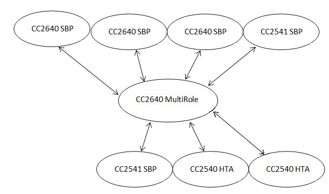
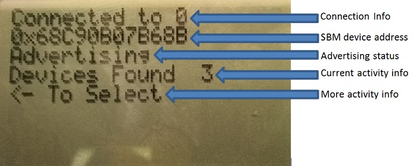
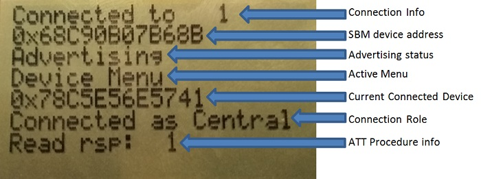

MultiRole
====================
### Purpose
This project will provide a demo to demonstrate a MultiRole project using the Texas Instruments BLE 2.1.0 SDK. The project added by the patch supplied here will be capable of functioning as a master and a slave simultaneously. The project is called multi_role and will be located at Projects\ble\multi_role\CC26xx. Both CCS and IAR projects are provided. Note that this is intended as proof-of-concept: there remains much work to do (see the relevant section below) and the software implementation may change drastically in future releases.
### Functional Overview
While this demo will allow the MultiRole device to connect to up to 7 other devices in any combination of roles, the following scenario was specifically considered and tested, where the arrows indicate BLE connections:

where:

    SBP = simpleBLEPeripheral project
    HTA = hostTestApp controlled by BTool

Note that any device and any combination of roles can be used as long as the connection interval rules stated in the limitations section below are followed.
### Limitations / Rules
Due to RAM limitations, the maximum amount of simultaneous connections that can be achieved is 7 for this specific configuration. If it is possible to remove some functionality such as simultaneous master / slave functionality, GATT profiles, LCD driver, application code, etc, it will be possible to increase the amount of simultaneous connections.

The GAPBondMGR is not supported with multiple connections in the 2.1 release so this project does not include it.

When at least one connection is already formed, in order to allow enough processing time to scan for a new connection, the minimum possible connection interval (in milliseconds) that can be used is:

    12.5 + 5*n

where n is the amount of current connections. For example, if there are currently four connections, all four connections must use a minimum connection interval of 12\*5 + 5\*4 = 32.5 ms in order to allow scanning to occur to establish a new connection.

The controller's scheduling mechanism after parameter updates occur has not been fully characterized. Parameter updates will not cause the connection to drop but may cause missed connection events. For greatest stability, all connections should be established at the same interval or multiples of the smallest connection interval.

The heap should be profiled to verify that there is enough memory for worst-case application use. The following are results from basic testing for various amounts of connections, using the demo instructions stated below. Note that the number of connections is set by the MAX_NUM_BLE_CONNS preprocessor definitions. The heap number shown below is the maximum amount of heap ever simultaneously allocated (heapmgrMemMax) for an IAR project. See the software developer's guide included with the installer for more information on profiling the heap.

| Number of Connections | Min Conn Interval (ms) | Heap Consumption (bytes) |
|:---------------------:|:----------------------:|:------------------------:|
| 1                     | 7.5                    | 1656                     |
| 2                     | 17.5                   | 2572                     |
| 3                     | 22.5                   | 3484                     |
| 4                     | 27.5                   | 4400                     |
| 5                     | 32.5                   | 5316                     |
| 6                     | 37.5                   | 6232                     |
| 7                     | 42.5                   | 7144                     |

Due to compiler differences, it is not possible to increase the heap size high enough to support 7 connections in CCS projects. Therefore, the maximum amount of connections supported when using CCS is 6.

### Assumptions
For this demo, the terms master / central and slave / peripheral are used synonymously. It is assumed that the master / central devices are GATT clients and slave / peripheral devices are GATT servers. Once the connection limit (MAX_NUM_BLE_CONNS which is set to 7 by default) is reached, the MultiRole device won’t be allowed to advertise / scan until there is a disconnection. It is assumed that all peripheral devices in the system have the simpleGATTProfile and expose this in their advertising data. However, it is possible for the peripheral devices in the system to have differing attribute tables since the MultiRole device will perform a service / characteristic discovery after each connection is formed.

### Requirements
###### Hardware
- 1 SmartRF06 Board + CC2640 EM
- 1-7 of either SmartRF06 Board's + CC2640 EM's, SmartRF05 Boards + CC254x EM's, Android devices, or iOS devices

###### Software
- TI 2.1.0 BLE-SDK: TI BLE stack
- multi_role project from this GIT page.

### Programming Devices
For the user's convenience, the following hex files are included at "/Projects/ble/multi_role/cc26xx/Demo Hex Files".  This is so that the demo can easily be setup without compiling the source projects.  These can also be compiled from the projects included with the multi_role project.

- CC2640_MR.bin: default MultiRole project as provided in the GIT project
- CC2640_SBP.bin: simpleBLEPeripheral project from the 2.1.0 installer, modified to disable default connection parameter update
- CC2540_SBP.hex: simpleBLEPeripheral project from the 2.1.0 installer, modified to disable default connection parameter update
- CC2541_SBP.hex: simpleBLEPeripheral project from the 2.1.0 installer, modified to disable default connection parameter update
- CC2540_HTR.hex: default CC2540 USB dongle HostTestRelease project included with the 1.4.1 installer. To be controlled via BTool to function as a central device.

At minimum, one CC2650 EM must be programmed with the CC2640_SBM.bin image. The remaining devices can be any combination of roles using one of the hex files above or iOS/ Android smart device.
SmartRF Flash Programmer 2 should be used to program CC2640 devices and SmartRF Flash Programmer should be used to program the CC254x devices. They are available at: http://www.ti.com/tool/flash-programmer

### MultiRole User Interface
###### Main Menu
Upon powering on or resetting the device, the user will be in the main menu. The main menu will generally look something like :

These lines are mostly self explanatory. Note that, on the Current Activity Info line, the menu name (and sometimes the next line – Number of Connections) will be overwritten by the current actions, such as during scanning, device disconnections, characteristic writes, connection establishments, etc. The following actions can be taken from the main menu (listed next to their action key):

- Up button: scan for devices
- Left button: browse through discovered devices
- Right button: turn advertising on / off. This will currently not work if a connection was just established in the central role.
- Down button: browse connected devices
- Select button: connect to a discovered device or enter the Device Menu for the given connected device

Note that the select button will function differently depending on whether the last action was browsing through discovered devices or connected devices.
###### Device Menu
Once the device menu is entered (by browsing through discovered devices and selecting a device), the directional buttons will work differently. Firstly, the LCD screen in the Device Menu will generally look like this:

These are mostly self explanatory. The following actions can be taken from the main menu (listed next to their action key):

- Up button: Read / Write Characteristic. This is currently only available for devices connected in the central role.
- Left button: nothing. In the future, this will enable / disable RSSI reading.
- Right button: nothing. In the future, this will perform a connection parameter update.
- Down button: Go back to the Main Menu.
- Select button: disconnect from the given device.

### Demo Instructions
While the functionality of the MultiRole device is certainly not limited to this demo, the following instructions should exercise most of the functionality. Note that it is assumed the user knows how to control the peripheral / central devices.

1. Power on all devices. The MultiRole device should indicate that it is “Advertising” on the Advertising Status line.

2. Connect to one or several peripheral devices from the MultiRole device.
    1. Press the up button to scan for devices and wait 4 seconds for results. Alternatively, press the up button again to end scanning.
    2. Use the left button to browse through the discovered devices until the address of the peripheral device is shown. Note that this address will be visible on the LCD screen of the SimpleBLEPeripheral if the SimpleBLEPeripheral hex file from above is used.
    3. Press the select button to establish a connection with the peripheral. The MultiRole device will indicate a connection has been formed and display the connected device's address.
    4. Do this for as many peripheral devices as desired.

3. The MultiRole device should still be advertising. Now, use a central device to connect to the MultiRole device. Do this for as many central devices as is desired. If the central device is the SimpleBLECentral hex file from above, the same steps from step 2 can be taken from the SimpleBLECentral to connect to the MultiRole device.

4. Once the maximum amount of devices are connected, the advertising status (and scanning status if the user attempts to start a scan) will indicate that there are no more available links so scanning / advertising is disallowed at this time.

5. From either central device, write to characteristic 1 (0xFFF1) or characteristic 3 (0xFFF3) of the simpleGATTProfile service (0xFFF0). When one of these characteristics is written to, it will be displayed on the Current Activity Info line of the LCD. The user should be able to control either characteristic from both central devices simultaneously.

6. To read / write peripheral device's characteristic 1 (0xFFF1) from the MultiRole device:
    1. Press the down button until the peripheral device’s address is shown after “Connected Device:” on the current action line.
    2. Press the select button to enter the Device Menu for this device.
    3. In the device menu, press the up button to read / write characteristic 1 from the peripheral device. It is necessary to wait for the read / write to finish before starting the next read / write.
    4. Press the down button to return to the main menu or, if desired, press the select button to disconnect from the peripheral and automatically return to the main menu.
