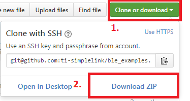

Extra examples for TI BLE-Stack 2.2.x SDK
=========================================

This repository contains additional sample applications and components for the Texas Instruments *Bluetooth&reg;* Low Energy software development kit. All Github sample apps are compatible with BLE-Stack 2.2.x. 

To use the examples and tools in this repository, please [download and install the SDK](http://www.ti.com/ble-stack) first, and if necessary [buy an evaluation kit](https://store.ti.com/Search.aspx?k=CC2650).

For other hardware and software resources, [please visit our wiki](http://www.ti.com/ble-wiki). If you have any questions please refer to the [FAQ page](docs/faq.md).

**Note:** Not all additional sample projects are migrated to GitHub. Additionally all examples on this page are targeted for the **`CC2650R1`** device - please refer to the Examples List below.

Installation
============

This repository can be cloned and tracked using Git. For instructions on how to clone a repository from Github please refer to this guide: [Clone from Github](https://help.github.com/articles/cloning-a-repository/)

For users who are unfamiliar with Git, there is the option of downloading the contents of the repository as a zip file. See instructions below.

    - Click the green "Clone or download" button
    - Select "Download ZIP" option
    - Zip folder will appear in your Downloads folder

&nbsp;&nbsp;&nbsp;&nbsp;

This repository can be cloned/download anywhere on your computer. There is a dependency between this repository and the BLE SDK install location.

By default the BLE SDK will install to:

        C:\ti\simplelink\ble_sdk_2_02_01_18

If the BLE SDK must be installed to a different location, then the examples in this repo will need to have the following environment variable updated

        TI_BLE_SDK_BASE

Follow your IDE specific instructions for changing environment variables or simply do a global search and replace within the ble\_examples folder. See the [FAQ page](docs/faq.md) for more details.

By default, TI\_BLE\_SDK\_BASE points to `C:\ti\simplelink\ble_sdk_2_02_01_18\`. If you installed the SDK there, no change is required.

Required Tools
==============

Similar to the BLE-Stack SDK, the examples in this repository support the IAR and CCS toolchains. Please pay careful attention to versions of these tools, the supported version are listed below. **Using a non supported version is untested and may result in unexpected behavior.**

 - IAR for ARM v7.70.2
 - CCS v6.2.0 with TI ARM Compiler v5.2.6
 
TI ARM Compiler is no longer installed by default in CCS v6.2.0. For instructions on installing TI ARM Compiler v5.2.6, please refer to the [Installing a Specific TI ARM Compiler](http://software-dl.ti.com/lprf/sdg-latest/html/cc2640/platform.html#installing-a-specific-ti-arm-compiler) of the TI BLE Software Developer's Guide.

For more information on toolchain setup, please refer to our [FAQ page](docs/faq.md).

FAQ
===

The [FAQ page](docs/faq.md) will try to address some of the common questions related to the ble_examples repo.

Examples List
=============

**Note: All of the sample applications below run on CC2650R1 based devopment kits. These examples will not work on CC2640R2 devices. For R2 examples, please ble_examples-3.0.**

The following examples are currently supported:

### beacon\_rfdriver
&nbsp;&nbsp;&nbsp;&nbsp;Send BLE advertisements directly using the RF driver

&nbsp;&nbsp;&nbsp;&nbsp;[docs](docs/beacon_rfdriver.md) | [project files](examples/cc2650lp/beacon_rfdriver) | [src](src/examples/beacon_rfdriver)

### hid\_adv\_remote\_privacy
&nbsp;&nbsp;&nbsp;&nbsp;Taking the BLE SDK HID advanced remote example and enableing Privacy 1.2

&nbsp;&nbsp;&nbsp;&nbsp;[docs](docs/hid_adv_remote_privacy.md) | [project files](examples/cc2650rc/hid_adv_remote_privacy) | [src](src/examples/hid_adv_remote_privacy)

### hid\_emu\_kbd
&nbsp;&nbsp;&nbsp;&nbsp;Emulate emulate a HID keyboard using the LaunchPad

&nbsp;&nbsp;&nbsp;&nbsp;[docs](docs/hid_emu_kbd.md) | [project files](examples/cc2650lp/hid_emu_kbd) | [src](src/examples/hid_emu_kbd)

### multi\_role
&nbsp;&nbsp;&nbsp;&nbsp;Implement multiple GAP roles on a single device.

&nbsp;&nbsp;&nbsp;&nbsp;[docs](docs/multi_role.md) | [project files](examples/cc2650lp/multi_role) | [src](src/examples/multi_role)

### security\_examples
&nbsp;&nbsp;&nbsp;&nbsp;Demonstrate BLE 4.2 Security Features on CC2650

&nbsp;&nbsp;&nbsp;&nbsp;[docs](docs/security_examples.md) | [central project files](examples/cc2650em/security_examples_central) | [peripheral project files](examples/cc2650em/security_examples_peripheral) | [central src](src/examples/security_examples_central) | [peripheral src](src/examples/security_examples_central)

### simple\_beacon
&nbsp;&nbsp;&nbsp;&nbsp;Demonstrate an implementation of a beacon that uses iBeacon technology

&nbsp;&nbsp;&nbsp;&nbsp;[docs](docs/simple_beacon.md) | [project files ](examples/cc2650lp/simple_beacon) | [src](src/examples/simple_beacon)

### simple\_central\_lp
&nbsp;&nbsp;&nbsp;&nbsp;SimpleBLECentral for CC2650 LaunchPad

&nbsp;&nbsp;&nbsp;&nbsp;[docs](docs/simple_central_lp.md) | [Launchpad project files](examples/cc2650lp/simple_central) | [src](src/examples/simple_central)

### simple\_central\_audio\_receiver
&nbsp;&nbsp;&nbsp;&nbsp;Receive and decode a voice stream over BLE using CC2650 central device and SensorTag,  
&nbsp;&nbsp;&nbsp;&nbsp;HID Advanced Remote or CC2650 LaunchPad with CC3200AUDBOOST peripheral device 

&nbsp;&nbsp;&nbsp;&nbsp;[docs](docs/simple_central_audio_receiver.md) | [project files](examples/cc2650lp/simple_central_audio_receiver) | [src](src/examples/simple_central_audio_receiver)

### simple\_peripheral\_audio\_transmitter
&nbsp;&nbsp;&nbsp;&nbsp;Encode and transmit an audio stream over BLE using CC2650 peripheral device on LaunchPad with CC3200AUDBOOST   
&nbsp;&nbsp;&nbsp;&nbsp;booster pack

&nbsp;&nbsp;&nbsp;&nbsp;[docs](docs/simple_peripheral_audio_transmitter.md) | [project files](examples/cc2650lp/simple_peripheral_audio_transmitter) | [src](src/examples/simple_peripheral_audio_transmitter)

### simple\_eddystone
&nbsp;&nbsp;&nbsp;&nbsp;Demonstrate an implementation of a beacon that uses the Eddystone beacon format

&nbsp;&nbsp;&nbsp;&nbsp;[docs](docs/simple_eddystone.md) | [project files ](examples/cc2650lp/simple_eddystone) | [src](src/examples/simple_eddystone)

### simple\_peripheral\_observer
&nbsp;&nbsp;&nbsp;&nbsp;Demo Peripheral and observer roles on CC2650

&nbsp;&nbsp;&nbsp;&nbsp;[docs](docs/simple_peripheral_observer.md) | [project files](examples/cc2650lp/simple_peripheral_observer) | [src](src/examples/simple_peripheral_observer)

### simple\_proprietary\_beacon
&nbsp;&nbsp;&nbsp;&nbsp;Demonstrate an implementation of a beacon that uses a potential proprietary beacon format

&nbsp;&nbsp;&nbsp;&nbsp;[docs](docs/simple_proprietary_beacon.md) | [project files ](examples/cc2650lp/simple_proprietary_beacon) | [src](src/examples/simple_proprietary_beacon)

### spp\_over\_ble
&nbsp;&nbsp;&nbsp;&nbsp;Send bidirectional UART data over BLE, similar to Serial Port Profile (SPP) in Bluetooth Classic

&nbsp;&nbsp;&nbsp;&nbsp;[docs](docs/spp_ble.md)  | [client project files](examples/cc2650lp/spp_ble_client) | [server project files](examples/cc2650lp/spp_ble_server) | [client src](src/examples/spp_ble_client) | [server src](src/examples/spp_ble_server)

### throughput\_example
&nbsp;&nbsp;&nbsp;&nbsp;Demonstrate the maximum theoretical throughput of a BLE link using the 2x CC2650 devices.  
&nbsp;&nbsp;&nbsp;&nbsp;These projects include a demo of 4.2 Data Length Extension, which improves throughput.

&nbsp;&nbsp;&nbsp;&nbsp;[docs](docs/throughput_example.md) | [central project files](examples/cc2650lp/throughput_example_central)  
&nbsp;&nbsp;&nbsp;&nbsp;[peripheral project files](examples/cc2650lp/throughput_example_peripheral) | [central src](src/examples/throughput_example_central) | [peripheral src](src/examples/throughput_example_peripheral)

### serial\_bootloader
&nbsp;&nbsp;&nbsp;&nbsp;Show implementation of the ROM Bootloader running from Flash memory.  
&nbsp;&nbsp;&nbsp;&nbsp;[docs](docs/serial_bootloader.md) | [project files](examples/util/serial_bootloader) | [src](src/util/serial_bootloader)

### central\_to\_multiperiperipheral
&nbsp;&nbsp;&nbsp;&nbsp;Demonstrate a central device disovering and connecting to multiple peripherals.  
&nbsp;&nbsp;&nbsp;&nbsp;[docs](docs/central_to_multiperipheral.md) | [project files](examples/cc2650em/central_to_multiperipheral) | [src](src/examples/central_to_multiperipheral)

References
==========

The following reference pages may be helpful during general BLE development. New users of the CC26xx platform and BLE are encouraged to read the [Software Developer's Guide](http://ti.com/lit/pdf/swru393) and complete the [SimpleLink Academy](http://software-dl.ti.com/lprf/simplelink_academy/overview.html) training.

Other resources can be found below:

* [BLE wiki](http://www.ti.com/ble-wiki)
* [BLE E2E Page](www.ti.com/ble-forum)