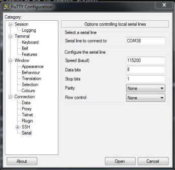

## Frequently Asked Questions

* [I am using a LaunchPad device, how can I view display data?](#display)
---

### I am using a LaunchPad device, how can I view display data?

LaunchPad projects general display output data through the use of a Display driver. For more
information the specific driver used depends on the SDK and the example, but all of these
drivers are thoroughly documented and may be modified to suit the project's needs.

To setup your PC to receive this data please follow the steps below:

1. Install PuTTY or another serial terminal emulator
1. Use the Windows Device Manager (Start &rarr; Run &rarr; `mmc devmgmt.msc`
    &rarr; Ok) to determine which COM port you should connect to:

    
    * Note the COM port number of the `XDS110 Class Application/User UART` listed.
1. Configure putty as a serial console with 115200 8N1.
1. Fill in the Serial Line field with the COM port from above.
1. When configured correctly, the program should look as below:

| Main Screen                                   | Serial Screen                         |
|:---------------------------------------------:|:-------------------------------------:|
|   |  |

**You may need to unplug/replug your LaunchPad and restart PuTTY if you do not see any output.**
