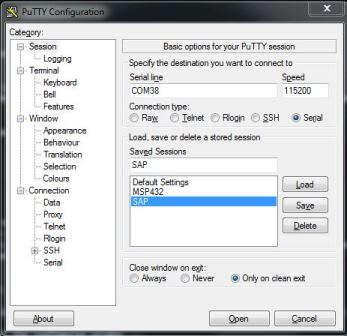

Frequently Asked Questions
==========================

1. Q: What if I installed the TI BLE SDK to a non default location (i.e. not `C:\ti\simplelink\ble_sdk_2_02_01_18`)
 - A : All projects reference files from the BLE stack using environment variables, you can change this in your IDE's project files

    **IAR**

    1. Navigate to a project within the repo (i.e. multi\_role -- examples/cc2650lp/multi_role/iar) and open the `.custom_argvars` file
    2. Replace any references to `C:\ti\simplelink\ble_sdk_2_02_01_18\` with your custom install location
    3. Rinse and repeat for all project files

    **CCS**

    1. Navigate to a project within the repo (i.e. multi\_role -- examples/cc2650lp/multi_role/ccs)
    2. Open the `.projectspec` file for the stack (inside the /stack folder) and change the path from `C:\ti\simplelink\ble_sdk_2_02_01_18\` to your custom path as below
    ```xml
    <pathVariable name="TI_BLE_SDK_BASE" path="c:/ti/simplelink/ble_sdk_2_02_01_18" scope="project"></pathVariable>
    ```
    3. Navigate to your project's app folder and repeat step 2.
    4. Rinse and repeat for all project files

2. Q: I get an error when I am trying to run a Python script from the /tools folder
 - A: Likely your Python environment is not installed correctly. Please check the following debug steps
    1. All scripts in the tools folder use Python 2.7, ensure that you have this version installed to `C:\Python27`
    2. Python scripts can be invoked using `python <script_name>.py` this requires adding Python to your environment variables
      - Add C:\Python27 and C:\Python27\Scripts to the `PATH` variable within your Windows environment vars, see [windows env vars](https://www.java.com/en/download/help/path.xml) for more info.
    3. If you can run the script successfully but get a runtime error, you likely don't have the necessary python modules installed.
      - Python modules can be found by looking at the `import` statements at the top of the `.py` file. You can install Python modules using the Python package manager, pip.
      - Install Pip by following [these steps](http://stackoverflow.com/questions/4750806/how-do-i-install-pip-on-windows). The section "Python 2 ≤ 2.7.8 and Python 3 ≤ 3.3" will be most helpful.

3. Q: How can I setup my toolchain for use with the ble\_examples repo?
 - A: Please check the steps below

    **IAR**

    1. Please refer to section 2.6.2 of the [Software Developer's Guide](http://ti.com/lit/pdf/swru393). Version 7.50.03 is supported.

    **CCS**

    1. Please refer to section 2.6.3 of the [Software Developer's Guide](http://ti.com/lit/pdf/swru393). Version 6.2.0 is supported.
     - Note that if your CCS install doesn't include TI ARM Compiler v5.2.6, refer to section 2.6.3.2 of the [Software Developer's Guide](http://ti.com/lit/pdf/swru393)

4. Q: I am using a LaunchPad device, how can I view display data?
 - A: LaunchPad projects that use the display driver are already setup to do so, for more information about the driver please see the Display.h header file within the TI-RTOS install `C:\ti\tirtos_cc13xx_cc26xx_2_20_01_08\products\tidrivers_cc13xx_cc26xx_2_20_01_10\packages\ti\mw\display`. <br> To setup your PC to receive this data please follow the steps below:

    1. Install PuTTY or another serial terminal emulator
    2. If not done, connect the LaunchPad to the computer using the micro USB cable.
    3. The Windows Device Manager (Start &rarr; Run &rarr; `mmc devmgmt.msc` &rarr; Ok) should show you the following devices connected:
       

    4. Note the COM port number of the `XDS110 Class Application/User UART` listed.
    5. Configure putty as a serial console with 115200 8N1.
    6. Fill in the Serial Line field with the COM port from above.
    7. When configured correctly, the program should look as below:


    | Main Screen                                      | Serial Screen                                        |
    |:-----------------------------------------------:|:----------------------------------------------------:|
    |    |    |


    **You may need to unplug/replug your launchpad and restart PuTTY if you do not see any output.**


