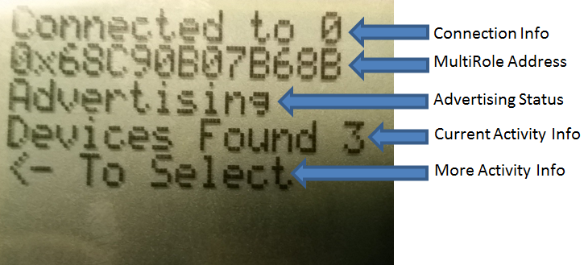
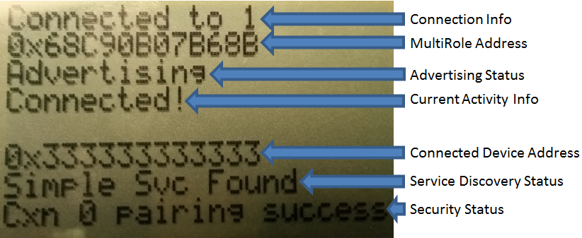
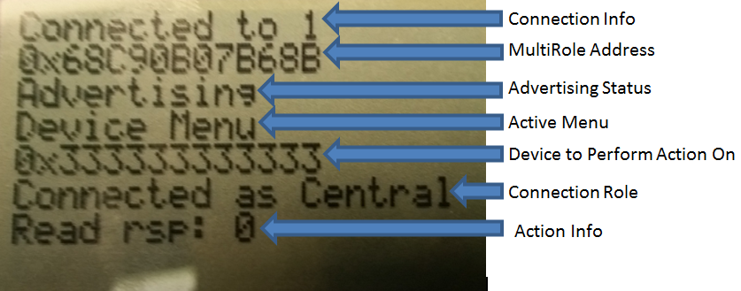

MultiRole
====================
### Purpose
This project will provide a demo to demonstrate a MultiRole project using the Texas Instruments BLE 2.2.0 SDK. The project is capable of functioning as a master and a slave simultaneously. Both CCS and IAR projects are provided.

### Functional Overview
As opposed to the 2.1.0 multi_role example, this version is capable of connecting to any central / peripheral device since connection parameter updates and security are now supported.  Connections can be established in any role.

### Limitations / Rules
Due to the large amount of functionality in this project, it is rather RAM-constrained.  If the project is configured for too many connections (via the MAX_NUM_BLE_CONNS preprocessor define) and also security, it is possible for heap allocation failures to occur which will break the stack. Therefore, the project should be stress-tested for its intended use case to verify that there are no heap issues by including the HEAPMGR_METRICS preprocessor define. See the debugging section of the software developer's guide for more information on how to do this.

When at least one connection is already formed, in order to allow enough processing time to scan for a new connection, the minimum possible connection interval (in milliseconds) that can be used is:

    12.5 + 5*n

where n is the amount of current connections. For example, if there are currently four connections, all four connections must use a minimum connection interval of 12\*5 + 5\*4 = 32.5 ms in order to allow scanning to occur to establish a new connection.

### Assumptions
For this demo, the terms master / central and slave / peripheral are used synonymously. It is assumed that the master / central devices are GATT clients and slave / peripheral devices are GATT servers. Once the connection limit (set with the MAX_NUM_BLE_CONNS preprocessor define) is reached, the MultiRole device won’t be allowed to advertise / scan until there is a disconnection.

When connected in the master role, the MultiRole device will query the slave device for the simpleGATTProfile service in order to demo some basic GATT procedures (read / write characteristic).  However, it is not necessary for the slave device to contain this service in order for a  connection to be established. That is, it is possible for the peripheral devices in the system to have differing attribute tables since the MultiRole device will perform a service / characteristic discovery after each connection is formed.

### Demo Requirements
##### Hardware
- 1 SmartRF06 Board + CC2640 EM
- 1-7 other devices to connect to the MultiRole.  
##### Software
- multi_role project from this GIT page
- [TI 2.2.0 BLE-SDK](https://www.ti.com/blestack) if it is desired to use the simpleBLEPeripheral project as a slave to expose the simpleGATTProfile for GATT procedure functionality

### MultiRole User Interface
###### Main Menu
Upon powering on or resetting the device, the user will be in the main menu. The following actions can be taken from the main menu (listed next to their action key):

- Up button: scan for devices
- Left button: browse through discovered devices
- Right button: turn advertising on / off
- Down button: browse connected devices
- Select button: connect to a discovered device or enter the Device Menu for the given connected device

Note that the select button will function differently depending on whether the last action was browsing through discovered devices or connected devices.

Here is an example of what the display would look like during a scan before a connection is established:

Here is an example of what the display would look like after a connection is established:

###### Device Menu
Once the device menu is entered (by pressing the down button to select a connected device from the Main Menu and then pressing select), the following actions can be taken:

- Up button: Read / Write Characteristic. This is currently only available for devices connected in the central role.
- Left button: nothing.
- Right button: perform connection parameter update
- Down button: Go back to the Main Menu.
- Select button: disconnect from the given device.

Here is an example of what the display would look like in the device menu:

