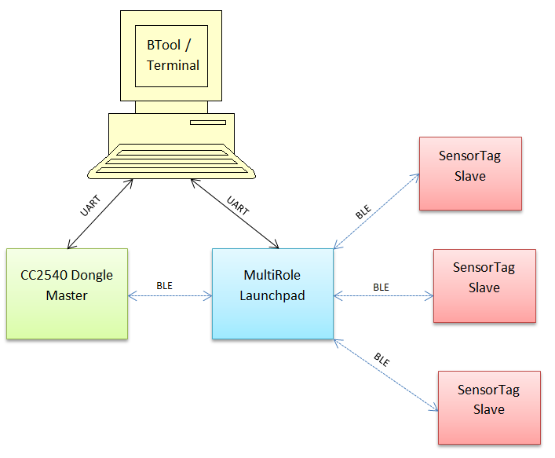
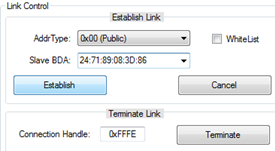
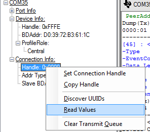
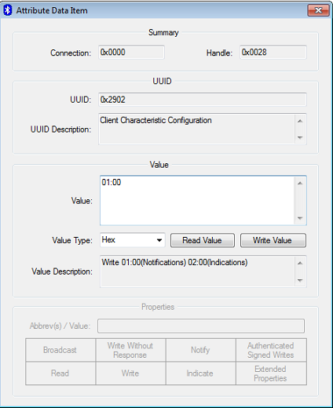
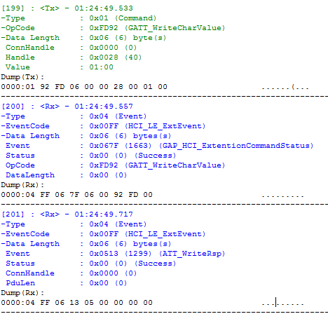
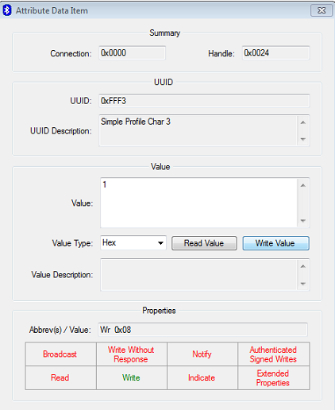
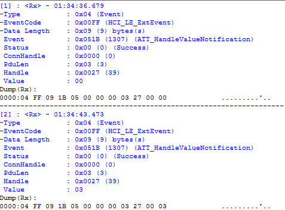
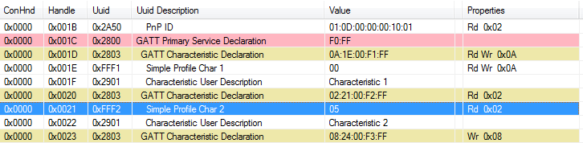

multi_role
====================
### Purpose
This project will provide a demo to demonstrate a multi_role project using the Texas Instruments BLE 2.2.0 SDK. The project is capable of functioning as a master and a slave simultaneously. Both CCS and IAR projects are provided.

### Functional Overview
The project is designed to scan for and connect to sensor tag devices as a master. More specifically, it is searching for any device which advertises the movement service UUID (0xAA64).  The project will accept any connection in the slave role. It is recommended to connect at a similar advertising interval with a master device as the the multi_role is using to connect to slaves (100 ms).  The devices can be connected in any order and any amount of devices can be connected in any role, assuming that the RAM constraints are considered as described below.

### Limitations / Rules
Due to the large amount of functionality in this project, it is rather RAM-constrained.  If the project is configured for too many connections (via the MAX_NUM_BLE_CONNS preprocessor define) and also security, it is possible for heap allocation failures to occur which will break the stack. Therefore, the project should be stress-tested for its intended use case to verify that there are no heap issues by including the HEAPMGR_METRICS preprocessor define. See the debugging section of the software developer's guide for more information on how to do this.  As a general guideline, 4 simultaneous connections can be maintained with the default configuration that includes security. If security is removed from the stack, up to 8 simultaneous connections can be maintained.

When at least one connection is already formed, in order to allow enough processing time to scan for a new connection, the minimum possible connection interval (in milliseconds) that can be used is:

    12.5 + 5*n

where n is the amount of current connections. For example, if there are currently four connections, all four connections must use a minimum connection interval of 12\*5 + 5\*4 = 32.5 ms in order to allow scanning to occur to establish a new connection.

For this demo, the terms master / central and slave / peripheral are used synonymously. It is assumed that the master / central devices are GATT clients and slave / peripheral devices are GATT servers. Once the connection limit (set with the MAX_NUM_BLE_CONNS preprocessor define) is reached, the multi_role device won’t be allowed to advertise / scan until there is a disconnection.

### Demo Topology
As mentioned above, any number of devices can be conneted in any role assuming the RAM constraints are considered. The specific topology that this demo was tested with is shown below:

That is, the multi_role connected to three sensor tags as a master and a CC2540 Dongle running BTool as a slave.  While any master device which is capable of discovering a devices services and writing to characteristics would work here such as the LiteBlue App on iOS or a similar mobile app, these instructions will detail the CC2540 Dongle + BTool.  Similar steps should be performed with a mobile app.

Beyond the four BLE connections (three slaves + one master), there are also two required UART connections to the PC:
- from BTool to control the CC2540 USB Dongle
- from a terminal application to the launchpad to display run-time information.

### Demo Requirements
##### Hardware
- 1 CC2650 [Launchpad](http://www.ti.com/tool/LAUNCHXL-CC2650)
- 3 CC2650 [Sensor Tags](http://www.ti.com/tool/cc2650stk)
- 1 CC2540 [USB Dongle](http://www.ti.com/tool/cc2540emk-usb) or mobile app

##### Software
- multi_role project from this GIT page
- [TI 2.2.0 BLE-SDK](https://www.ti.com/blestack)
- BTool (included with the TI 2.2.0 BLE-SDK install)

### multi_role User Interface
1. Open a terminal application with the launchpad UART port with a baud rate of 115200, 8 data bits, 1 stop bit, no parity bits, and no flow control
2. Compile the multi_role project, load onto the Launchpad and run. The terminal will display the following where the first line is the multi_role devices address:
~~~~
0x247189083D86
Connected to 0
Initialized
~~~~
3. Power up the three sensor tags. The blinking green LED will indicate that they are advertising.
4. Plug in the CC2540 USB Dongle and open it in BTool with a baud rate of 115200, 8 data bits, 1 stop bit, no parity bits, and no flow control. Ensure to choose the correct COM Port
5. In BTool, scan for devices and connect to the multi_role:

6. In BTool, discover the multi_role's characteristics by right clicking on the connection handle and selecting "Read Value:"

 
7. After the values are read and displayed in the bottom pane in BTool, enable notifications of the fourth simpleGATTProfile characteristic by writing 0x0001 to its client characteristic configuration. This can be initiated by double clicking on the attribute at handle 0x0028 and sending the write as follows:
8. The BTool log can be checked to verify the write was completed succesfully:
 
9. Now that the multi_Role GATT client is configured correctly, connect to the sensor tag slaves by pressing the left button on the launchpad to initiate scanning and link establishment.  The launchpad will output log information to the terminal during this process, i.e.:
~~~~
 Discovering...
 Done scanning.
 Connecting...
 Cxn 1 pairing started
 Connected!
 Connected to 2
 0xAAAAAAAAAAAA
 Ready to Advertise
 Cxn 1 pairing success
 Chars Discovered
 Chars Init'd
 Advertising
 Discovering...
 Done scanning.
 Connecting...
 Cxn 2 pairing started
 Connected!
 Connected to 3
 0xBBBBBBBBBBBB
 Ready to Advertise
 Cxn 2 pairing success
 Chars Discovered
 Chars Init'd
 Advertising
 Discovering...
 Done scanning.
 Discovering...
 Done scanning.
 Discovering...
 Done scanning.
 Connecting...
 Cxn 3 pairing started
 Connected!
 Connected to 4
 0xCCCCCCCCCCCC
 Can't adv: no links
 Cxn 3 pairing success
 Chars Discovered
 Chars Init'd
 ~~~~
10. Now that all the connections are formed and configured, actions can be performed as desired.
11. LED's can be turned on off from BTool by writing a 1 or 0 to the launchpad's simple profile characteristic 3. This can be done by double clicking on handle 0x0024 and sending a 1 or 0:

 When the launchpad receives this write, it will turn on / off its LED and then send writes to each of the sensor tags to turn on / off their LEDs. The launchpad will also output log information to the terminal.

12. LED's can also be toggled by pressing any of the sensor tags' right buttons. This will send a notification from the sensor tag to the launchpad, which will then write to all of the sensor tags to toggle their LED's. The launchpad will also output log information to the terminal send a notification to the master of the LED value which can be seen in the BTool log:

13. The left button on any of the sensor tags will send a notification to the launchpad. The launchpad will keep a total count of buttons pushed from all sensor tags combined (outputted to terminal).
~~~~
Button from: 2
Button count: 1
Button from: 2
Button count: 2
Button from: 1
Button count: 3
Button from: 1
Button count: 4
Button from: 3
Button count: 5
~~~~
 This value can be asynchronously retrieved from BTool by reading the launchpad's simple profile characteristic 2. This can be done in BTool by single clicking on handle:

