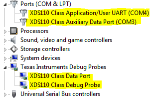

Purpose / Scope
===============

This page will document how to demonstrate an end to end BLE voice solution using two CC2650 devices.
Emphasis will be placed on the central device which is responsible for receieving and decoding the voice stream.

TI's voice system has long supported streaming voice data from the Pulse Density Modulation (PDM) microphone on the CC2650 SensorTag and HID Advanced Remote kits. Now support for the CC3200AUDBOOST boosterpack and another compression algorithm, mSBC, is added.
Voice data is transferred over BLE using the TI audio\_profile which is a Voice Over GATT Profile (VoGP) design. This profile has been update to add an additional start byte. This new start byte indicates that the following stream uses mSBC compression.
In this demo, data flows unidirectionally between a streamer (GATT server) and a receiver (GATT client) device.

In addition to the `simple_peripheral_audio_transmitter`, the following streamer examples from the BLE-Stack SDK are supported:
 - `hid_adv_remote`
 - `sensortag_audio`

The streaming devices are the ones containing the PDM microphone on board, and CC2650 LaunchPad with CC3200AUDBOOST boosterpack. These are the devices the user will ultimately be speaking into, or send audio to via 3.5mm jack.
The PDM microphone based devkits and firmware examples can be found within the BLE-Stack SDK release.

Simple Central Audio Receiver is designed to demonstrate receiving and decoding (for playback or cloud based speech recognition) the voice stream from one of the supported streamer examples above. This example is based on the simple\_central project from the **BLE-Stack v2.2.1** installer.

The central project was slightly modified to:

 - Run on the CC2650 LaunchPad
 - Automatically connect to CC2650 SensorTag, CC2650RC or CC2650 LaunchPad with CC3200AUDBOOST based on advertisement data
 - Receive voice stream using the TI VoGP audio\_profile
 - Decode the voice stream and output to headphone/line out on CC3200AUDBOOST. Connect this to headphones, or speaker
 - [Optional] Stream audio data with IMA-ADPCM mechanism using Data Length Extension feature
 - [Optional] Send the voice stream to the PC over UART for post processing (Python script included)

Streaming Voice over BLE
========================

For more information about the technical details of TI's Voice Over BLE Solution please see:
 - [Voice Streaming on CC2650](http://processors.wiki.ti.com/index.php/CC2650RC_Getting_Started_with_Development#Voice_Streaming_on_the_CC2650RC)
 - [Voice Over BLE](http://processors.wiki.ti.com/index.php/BLESDK-2.2.x-CC2650RC_Developers_Guide#Voice_Over_BLE)

_Note: The above links also apply to sensortag\_audio projects as well. They employ the same firmware components (PDM driver, audio\_profile, etc) as the Remote Control solutions, but deploy on a different dev board._

Some quick facts about voice over BLE:

 - Input device: `Pulse Density Modulation (PDM) Microphone` or `CC3200AUDBOOST boosterpack`
 - Sample rate: `16kHz`
 - Bit Depth: `16 bits`
 - Compression mechanism: `4:1 IMA-ADPCM` or `mSBC`
 - Required application throughput: `66.67kbps` or `60.8kpbs`
 - Voice quality (IMA-ADPCM) has been qualified by Nuance and is sufficient for voice recognition solutions


Prerequisites
=============

#### Hardware Requirements

Before running the demo, the user will need the following components:

- CC2650 voice enabled development kit (SensorTag, HID Advanced Remote or CC2650 LaunchPad with CC3200AUDBOOST)
  - [CC2650 RC](http://www.ti.com/tool/cc2650rc)
  - [CC2650 STK](http://www.ti.com/tool/cc2650stk)
  - [CC2650 LaunchPad](http://www.ti.com/tool/launchxl-cc2650)
    with [CC3200AUDBOOST](http://www.ti.com/tool/cc3200audboost)
- [BLE-Stack v2.2.1](http://www.ti.com/ble-stack)
- [CC2650 LaunchPad](http://www.ti.com/tool/launchxl-cc2650)
- A device to output audio over a 3.5mm jack (connected to the LINE-IN, 3.5mm stereo jack, of the CC3200AUDBOOST boosterpack)
- **OPTIONAL:** A PC that supports `.wav` file playback, and/or view logging via UART-over-USB, @460800 baudrate
- **OPTIONAL:** [Sharp LCD BoosterPack](http://www.ti.com/tool/430boost-sharp96)

#### Firmware Requirements

_Note: Apple headphones will not work with the CC3200 boosterpack_

1. Load the voice streaming device with it's proper firmware image from the BLE-Stack SDK
  * For the CC2650 STK this is the `sensortag_audio` project
  * For the CC2650 RC this is the `hid_adv_remote` project
  * For the CC2650 LaunchPad with CC3200AUDBOOST this is the `simple_peripheral_audio_transmitter` project
2. Load the `simple_central_audio_reciever` project onto the CC2650 LaunchPad
3. **OPTIONAL** Handle Python dependencies for  `audio_frame_serial_print.py` from [tools/scripts/audio folder](../tools/scripts/audio)
  * Requires [Python 2.7](https://www.python.org/download/releases/2.7/)
  * The script also requires the following Python modules: struct, wave, serial, time, winsound
  * See the [FAQ](faq.md) for more info


Running the Demo
================

#### A Note for SensorTag Users

  * In order for the `sensortag_audio` project to run standalone (without a debugger attached), a BIM project must be loaded.
   * BIM can be loaded using the project in `\examples\util\bim_extflash`, be sure to use the `FlashOnly_ST` configuration.

  * Additionally the `sensortag_audio` project for CCS will need to have a target configration added to the app project.
    * The target config can be added to the app project by copying the `CC2650F128.ccxml` file from the /targetConfigs folder of the stack project to into the app project.

  * `sensortag_audio` for CCS in BLE 2.2.1 does not have pairing and bonding enabled by default. You may see "pairing failed" on the screen. This is safe to ignore, the
  demo will proceed correctly.

#### Voice Streaming on the CC2650

After building the firmware required for the voice transmitter and receiver, you are ready to demo the voice capabilities of the CC2650.

1. Power up the transmitter launchpad
 * If the serial port is attached it will log
 ```
 Audio Tx Peripheral
 <BD_ADDR>
 Initialized
 Advertising
 ```

2. Power up the audio\_receiver device
 * If the serial port is attached it will log
 ```
 Audio Central
 <BD_ADDR>
 Initialized
 Idle...
 ```
3. Start Discovery on the central device by pressing the left key on the LaunchPad. Scanning is indicated by blinking green LED on the LaunchPad.
 * The Central device will scan the peripheral's advertisement data for either the TI\_COMPANY\_ID (SensorTag), the HID\_SERV\_UUID (HID Advanced Remote) or SIMPLEPROFILE\_SERV\_UUID (Audio Tx Peripheral).
 * After finding devices that list these services their advertisement payloads it will scan for the following device names:
 ```c
  static uint8 remoteNameST[] =
  {
    'C', 'C', '2', '6', '5', '0', ' ',
    'S', 'e', 'n',  's',  'o',  'r',  'T',  'a',  'g',
  };
  ...
  static uint8 remoteNameRC[] =
  {
    'H', 'I', 'D', ' ', 'A', 'd', 'v', 'R', 'e', 'm', 'o', 't', 'e'
  };
  ...
  static uint8 remoteNameTx[] =
  {
      'S', 'i', 'm', 'p', 'l', 'e',
      'B', 'L', 'E',
      'A', 'u', 'd', 'i', 'o', 'T', 'x',
  };
 ```
4. If an acceptable voice streaming device is found (STK, CC2650RC or CC2650LP) then the central will connect, pair, and bond to the device. If attached the serial port will log:
 * Audio Central
  ```
  Discovering...
  Pairing started
  Connected
  <PEER_BD_ADDR>
  Pairing success
  Bond Saved OR Param Update: 0
  ```
 * Audio Tx Peripheral
  ```
  Connected
  <PEER_BD_ADDR>
  ```
5. The devices are now ready to stream voice over BLE.
 * Press and hold the MIC button to start streaming voice from the HID Advanced Remote
 * Press and hold the right key on the SensorTag to start streaming voice from the SensorTag
 * If using the launchpad press:
  * Right button to start transmitting with ADPCM compression
  * Left button to start transmitting with mSBC compression
  * Press both buttons simultaneously to stop transmitting
6. The demo is written such that, once a sensortag, remote control or transmitting launchpad is discovered, the audio\_receiver project will pair and bond to it. Scanning/connecting to other devices is not allowed while bonded. (i.e. left button is disabled). In order to "forget the devices" you should:
 * Power off your audio transmitting device. Wait for link to be terminated. Red LED will turn on.
 * Press the right key to erase the bonds from the audio\_receiver project. Green LED will blink 1x while red LED stays on.
 * The bonds are now erased, you can discover and connect to another device.

Optional demo : Stream audio data with IMA-ADPCM mechanism using Data Length Extension feature
------------

The Data Length Extension feature for this stack projet is enabled by adding -DBLE_V42_FEATURES=EXT_DATA_LEN_CFG into build_config.opt file
The needed modification for the application project is wrapped around in the DLE_ENABLED predefine symbol.
The MAX_PDU_SIZE has been modified to be 107.

To enable the application to send 100 bytes audio data in one frame, you simply need to enable DLE_ENABLED in the predefine symbol.

_Note: Data Length Extension feature only supports ADPCM format for now_

Once Data Length Extension feature is enabled, the attached serial port will log:
 * Audio Central with DLE
  ```
  Discovering...
  Pairing started
  Connected
  <PEER_BD_ADDR>
  Pairing success
  Bond Saved
  ```
 * Audio Tx Peripheral with DLE
  ```
  Connected
  <PEER_BD_ADDR>
  ```

Optional demo : Send the voice stream to the PC over UART for post processing (Python script included)
------------

It is possible to send the stream to a PC. In this case there will be no logging via UART, for logging please mount LCD on top of CC3200AUDBOOST. To enable this one must rebuild the `simple_central_audio_reciever` project with the following modifications in Project-->C/C++ Compiler-->Preprocessor-->Defined symbols:
```
xSTREAM_TO_AUDBOOST
STREAM_TO_PC
BOARD_DISPLAY_EXCLUDE_UART
xBOARD_DISPLAY_EXCLUDE_LCD
```

There are two python scripts for decoding and recording audio. `audio_frame_serial_print` is used for ADPCM stream, and `pySBC27` is used for mSBC format. The instructions below are written for the `audio_frame_serial_print`. To decode mSBC simply replace all references to `audio_frame_serial_print` below with `pySBC27`.

1. Connect the audio\_receiver (CC2650 LaunchPad) device to your PC. Use windows device manager to note the COM port, it is the User/UART port (COM4 in picture below)

   

2. Make note of the COM port from step #1 and update the Python script to use that port by replacing COM91 the following line:
    ```Python
    ser = Serial("COM91", 460800, timeout=0.1)
    ```
   * The python script requires pyserial and other dependencies to be installed please see the [FAQ](faq.md) for more info.  
3. Run `audio_frame_serial_print.py`
4. Power up the voice streaming device.
 * The SensorTag will advertise out of the box, this is indicated by the green blinking LED.
 * The HID Advanced Remote will advertise after any button press.
 * The CC2650 LaunchPad with CC3200AUDBOOST will always advertise when not in connection
5. Power up the audio\receiver device
 * If the LCD is mounted it will display
 ```
 Audio central
 <BD_ADDR>
 Idle...
 ```
6. Start Discovery on the central device by pressing the left key on the LaunchPad. Scanning is indicated by blinking green LED on the LaunchPad.
 * The Central device will scan the peripheral's advertisement data for either the TI\_COMPANY\_ID (SensorTag), the HID\_SERV\_UUID (HID Advanced Remote) or SIMPLEPROFILE\_SERV\_UUID (Audio Tx Peripheral).
 * After finding devices that list these services their advertisement payloads it will scan for the following device names:
 ```c
  static uint8 remoteNameST[] =
  {
    'C', 'C', '2', '6', '5', '0', ' ',
    'S', 'e', 'n',  's',  'o',  'r',  'T',  'a',  'g',
  };
  ...
  static uint8 remoteNameRC[] =
  {
    'H', 'I', 'D', ' ', 'A', 'd', 'v', 'R', 'e', 'm', 'o', 't', 'e'
  };
  ...
  static uint8 remoteNameTx[] =
  {
      'S', 'i', 'm', 'p', 'l', 'e',
      'B', 'L', 'E',
      'A', 'u', 'd', 'i', 'o', 'T', 'x',
  };
 ```
7. If an acceptable voice streaming device is found (STK, CC2650RC or CC2650LP) then the central will connect, pair, and bond to the device. If attached the serial port will log:
 * Audio Central
  ```
  Discovering...
  Pairing started
  Connected
  <PEER_BD_ADDR>
  Pairing success
  Bond Saved OR Param Update: 0
  ```
 * Audio Tx Peripheral
  ```
  Connected
  <PEER_BD_ADDR>
  ```
8. The devices are now ready to stream voice over BLE
 * Press and hold the MIC button to start streaming voice from the HID Advanced Remote
 * Press and hold the right key on the SensorTag to start streaming voice from the SensorTag
 * On the transmitting launchpad press:
	* Right button to start transmitting with ADPCM compression
	* Left button to start transmitting with mSBC compression
	* Press both buttons simultaneously to stop transmitting

9. The Python script will read the voice frames from the CC2650 and decode them into `.wav` files. These files can be played back on the PC.
* The files are saved in the format: `pdm_test_%Y-%m-%d_%H-%M-%S_adpcm` where Y, m, d, H, M, S are used to store the time stamp when the file was saved.

10. The demo is written such that once a sensortag or remote control is disovered the audio_receiver project will pair and bond to it. Scanning/connecting to other devices is not allowed while bonded. (i.e. left button is disabled). In order to "forget the devices" you should:
 * Power off your audio streaming device (sensortag or remote control). Wait for link to be terminated. Red LED will turn on.
 * Press the right key to erase the bonds from the audio_receiver project. Green LED will blink 1x while red LED stays on.
 * The bonds are now erased, you can discover and connect to another device.

Demo LED states
===============

The following states of the device can be described by the red and green LEDs on the LaunchPad.
* Idle + bonds forgotten: Red LED is on, solid
* Scanning for devices: Green LED is flashing
* Device connected + bond saved: Green LED is on, solid
* Device connected and bonded + streaming voice: Red LED blinks on both LP and STK or Remote.
* Bonds forgotten: Green LED blinks 1x while red LED is on.

Useful tip
==========

To make more RAM available to HEAP some variables can be placed in AUX_RAM. This ram is available when the Sensor Controller is not in use. The following code shows this placement:

IAR:
```
#pragma default_variable_attributes = @ "AUX_RAM_SECTION"
```

CCS:
```
#pragma DATA_SECTION(i2sContMgtBuffer, ".aux_ram")
#pragma DATA_SECTION(audio_encoded, ".aux_ram")
#pragma DATA_SECTION(sbc, ".aux_ram")
#pragma DATA_SECTION(written, ".aux_ram")
#pragma DATA_SECTION(streamVariables, ".aux_ram")
```

References
==========
 * [CC2650 Remote Control User's Guide](http://processors.wiki.ti.com/index.php/CC2650RC_UG)
 * [CC2650 Remote Control Developer's Guide](http://processors.wiki.ti.com/index.php/CC2650RC_Getting_Started_with_Development#Getting_started_with_Development)
 * [CC2650 SensorTag User's Guide](http://processors.wiki.ti.com/index.php/CC2650_SensorTag_User%27s_Guide)
 * [Voice Over BLE](http://processors.wiki.ti.com/index.php/BLESDK-2.2.x-CC2650RC_Developers_Guide#Voice_Over_BLE)
