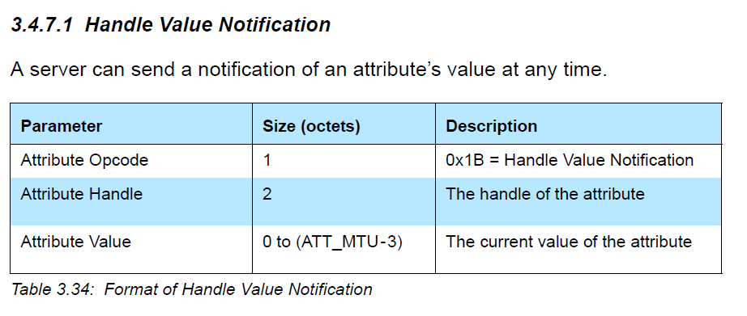
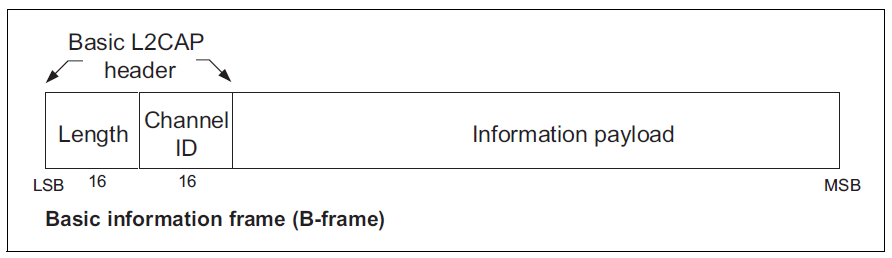
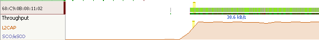
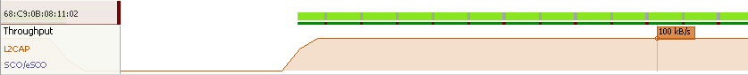

Purpose / Scope
===============

This example page will demonstrate the maximum BLE throughput that can be
achieved with a Texas Instruments CC2640 where the following assumptions
are made:

-   Both sides of the connection are CC2640 devices. Other stacks in
    master devices such as iOS and Android will limit the maximum
    packets per connection interval, thus limiting the throughput. See
    this [blog
    post](https://punchthrough.com/blog/posts/maximizing-ble-throughput-on-ios-and-android)
    on how to maximize throughput with Android & iOS devices.
-   Ideal RF conditions. Missed events / CRC errors due to RF
    interference will limit the throughput.
-   Both sides of the connections support the Data Length Extension feature
    of the spec.
-   Neither master nor slave device contains processing that will starve
    the controller, thus limiting throughput. That is,
    application-specific processing or other custom constraints may
    further decrease throughput.

The throughput being measured is actual usable payload GATT throughput.
Any LL / L2CAP headers are not considered part of the throughput.
The GATT architecture used is such that the GATT server is sending GATT
notifications to the GATT client.

This example is based on the simple\_peripheral and simple\_central projects
from the **BLE-Stack v2.2.0** installer.

These projects are slightly modified to:

 - Use max ATT_MTU values
 - Use max data payload of LE controller (Data length extension)
 - Queue and send data (notifications) over BLE

Parameters
==========

The basic idea is to be constantly sending GATT notifications, with as
little overhead as possible, and as little downtime as possible. The
following parameters must be considered.

### ATT\_MTU Size

Please refer to Section "5.5.2 Maximum Transmission Unit (MTU)" in the
CC2640 BLE SW Developer's Guide
([SWRU393](http://www.ti.com/lit/pdf/swru393)) for an explanation of the
Attribute Protocol Maximum Transmission Unit (ATT\_MTU).

In order to minimize L2CAP header overhead, the maximum ATT\_MTU size is
being used: 251 bytes. This will result in 244 byte notifications being
sent. This means that there is a 7 byte L2CAP overhead for every 244
bytes sent. In order to achieve this, both SBP and SBC project must set
the following defines in bleUserConfig.h:

    #define MAX_NUM_PDU                   6

    #define MAX_PDU_SIZE                  251

This will allocate 6 Tx buffers of 251 bytes. A custom application will
need to be profiled to verify that there is enough heap for the desired
PDU / PDU size combination.

If there is not, then the MAX\_NUM\_PDU define can be decreased, possibly
causing a loss of throughput. Since the actual (worst case) memory used
is a product of the MAX\_NUM\_PDU & MAX\_PDU\_SIZE, the system designer
will need to balance these parameters according to available memory and
capability of the peer device. For example, when interfacing to an iOS8+
device, a MAX\_PDU\_SIZE=162 and MAX\_NUM\_PDU=6 would match the iOS
device's ATT\_MTU of 158 and up to 6 packets per connection event. These
parameters may vary from a given iOS release or device.

Note that the max PDU size is not selected to be 255 (max supported by
host). This has to do with the maximum data payload supported by the data
length extension feature in the conroller.
Data length extension's role in the the throughput study is covered in depth
in the next section.

### LE Controller Data Payload / LE Data Length Extension

The newest _Bluetooth_ 4.2 specification allows the controller to send
data packets containing up to 251 bytes of application data in a single
packet. This is a drastic increase when compared to the previous specifications
which limited all controller data payloads to be 27 bytes. This feature
is called data length extension. Please refer to Section "5.6
LE Data Length Extension" in the CC2640 BLE SW Developer's Guide for more
information. ([SWRU393](http://www.ti.com/lit/pdf/swru393))

Data length extension (DLE) is supported by CC2650/CC2640 devices running
BLE-Stack v2.2. This throughput example has been updated to use DLE.

With DLE enabled, the LE controller can spend more time sending application
data and less time processing packet overhead, thus increasing throughput.

In order to optimize the pipe between the two devices, the ATT\_MTU is limited
to be 251 bytes (instead of 255).
As mentioned above, the largest data payload supported by the
controller is 251 bytes. Setting ATT\_MTU to be 255 would cause the controller
to have to fragment and recombine host data packets at the link layer. This will negatively
affect throughput. This is because there is overhead for each data packet sent.
See the packet overhead section for more details.

Note that not all 4.2 devices will support DLE. Throughput to mobile devices
may be limited based on the capabilities of the device's BLE stack.

### Connection Interval

Depending on the amount of post/pre-processing, the controller needs 2-3
ms to prepare for the next connection event. Therefore, longer
connection intervals allow for higher throughput as there is less
downtime where notifications are not being sent. This example will use a
connection interval of 200 ms. Note that there is a significant downside
to using higher intervals in a real world scenario: missed connection
events due to RF interference will drastically decrease the throughput.
Therefore, it is up to the user to decide what throughput / latency
tradeoff is desired. Note that there is not much of a throughput
increase after ~ 100 ms connection interval:

### Notification Queuing

The case considered here assumes that the application is able to queue
up notifications quickly enough so that there is always a notification
ready to be sent when a slot opens. This is achieved by the application
RTOS task running in an infinite loop in throughput\_example\_peripheral.c:

    static void blastData()
    {
      uint16 len = MAX_PDU_SIZE-7;
      attHandleValueNoti_t noti;
      bStatus_t status;
      noti.handle = 0x1E;
      noti.len = len;

      while(1)
      {
        //attempt to allocate payload
        noti.pValue = (uint8 *)GATT_bm_alloc( 0, ATT_HANDLE_VALUE_NOTI, GATT_MAX_MTU, &len );

        if ( noti.pValue != NULL ) //if allocated
        {
          //place index
          noti.pValue[0] = (msg_counter >> 24) & 0xFF;
          noti.pValue[1] = (msg_counter >> 16) & 0xFF;
          noti.pValue[2] = (msg_counter >> 8) & 0xFF;
          noti.pValue[3] = msg_counter & 0xFF;
          status = GATT_Notification( 0, &noti, 0 );    //attempt to send
          if ( status != SUCCESS ) //if noti not sent
          {
            GATT_bm_free( (gattMsg_t *)&noti, ATT_HANDLE_VALUE_NOTI );
          }
          else //noti sent, increment counter
          {
            msg_counter++;
          }
        }
        else
        {
          //bleNoResources
          asm("NOP");
        }
      }
    }

Due to other processing needs, a custom application may not be able to
replicate or sustain this throughput (e.g., having to wait for payload
data to arrive over serial interface). In addition, the blastData
function maximizes enqueuing of data (Notifications in this example), so
it is expected to see GATT\_Notification return a non-SUCCESS status,
such as blePending when the queue is full. When this status is returned,
the BLE Stack will gradually clear the Tx queue as channel conditions
permit, thus allowing the application to enqueue more GATT Notifications
once the queue clears. The depth of the Tx queue is determined by the
MAX\_NUM\_PDU define listed above.\
Note that the LED pins are used for debugging. Under maximum throughput
conditions, you may expect to see a high number of blePending
(non-SUCCESS) status results from calling GATT\_Notification.

### Packet Overhead

The host and controller data payloads have been optimized to be 251 bytes.
This is the maximum value that makes sense for optimizing throughput.

However, not all 251 bytes can be used as application data due to overhead that is incured at the ATT and L2CAP levels.
These headers are required by the BLE spec and cannot be changed. A brief description of this is shown below.

#### ATT Notification Header

All ATT notification packets have a 3 byte header required to identify the opcode and handle of the attribute that is sending the notification.
See the snippet below from the BLEv4.2 spec.

In summary there is a 3 byte overhead to sending an ATT notification.

#### L2CAP Header

At the L2CAP layer, similar overhead is required to set the lenght of the packet and the proper channel identifier (CID).

Each of these fields are 16-bits (2 bytes) resulting in 4 bytes of L2CAP overhead.

See the screen capture below from the BLEv4.2 specification.

Combining the L2CAP and ATT packet overhead yields:

    TOTAL_PACKET_OVERHEAD = 7 bytes

Running the Demo
======

The throughput will be calculated from an extrapolation of the amount of
data sent in one connection event. This will be cross referenced with
the one second throughput from an Ellisys sniffer.
The test can be replicated via:

1. Clone/download throughput_example code from this repo
  - throughput\_example\_peripheral
  - throughput\_example\_central
2. Compile throughput\_example\_peripheral and throughput\_example\_central projects
  - The suggested controller payload data length can be defined by setting the define APP\_SUGGESTED\_PDU_SIZE, which to optimize throughput has been set to 251.
3. Connect throughput\_example\_peripheral to throughput\_example\_central
  - These projects use the Display driver to output display data over UART, see our [FAQ page](faq.md) for more information on using this feature. Follow the FAQ page instructions to start two terminal sessions to view the output of each project.
  - The peripheral project will use a hardcoded BD_ADDR of 0xAABBCCDDEEFF, press both left and right buttons to auto connect to it.
  - Pressing KEY_LEFT on the peripheral device will initiate a data length exchange, which will enable BLE 4.2 Extended Data Length exchange. The new controller payload will be 251B.
  - Red LED binlking on the peripheral indicates that the throughput test is running
  - The central device will dynamically calculate the throughput and display on the LCD/UART.
4. Once the MTU update exchange is complete, the throughput test will start

Result
======
Using the parameters described above, we are able to achieve a
throughput of around 38.6kB/s without data length extension

Using data length extension and the maximum controller data payload we see a throughput increase to 100kB/s.

Throughput calculations can be done by hand following this equation

    THROUGHPUT_KBPS = (NUM_PACKETS_PER_CXN_EVT) * (NUM_BYTES_PER_PACKET - TOTAL_PACKET_OVERHEAD)/ (CONNECTION_INTERVAL)

With standard controller features the throughput example will use the following vars

    NUM_BYTES_PER_PACKET = 27 bytes
    TOTAL_PACKET_OVERHEAD = 7 bytes
    CONNECTION_INTERVAL = 200ms

With DLE enabled the throughput example will use the following vars

    NUM_BYTES_PER_PACKET = 251 bytes
    TOTAL_PACKET_OVERHEAD = 7 bytes
    CONNECTION_INTERVAL = 200ms

As an example, from the above sniffer capture 85 packets of 244 data payload bytes are
sent in one connection event (200 ms). This comes out to 103.7kB/s which is
similar to what Ellisys is calculating.
