ANCS Demo
=========

## Table of Contents

* [**Introduction**](#Introduction)
* [**Hardware Prerequisites**](#hardware-prerequisites)
* [**Software Prerequisites**](#software-prerequisites)
* [**Preprocessor Defines**](#preprocessor-defines)
  * [**USE\_GUI\_COMPOSER**](#use_gui_composer)
  * [**USE\_WATCHDOG\_TIMER**](#use_watchdog_timer)
  * [**IGNORE\_PREEXISTING\_NOTIFICATIONS**](#ignore_preexisting_notifications)
* [**Usage**](#Usage)
  * [**GUI Composer Demonstration**](#gui_composer_demonstration)
  * [**UART Demonstration**](#uart-demonstration)

## Introduction

The ANCS project implements a simple Bluetooth low energy
peripheral device acting as a GATT client which receives Apple notification data
from a mobile Apple device acting as a GATT server. This project is meant to
demonstrate a basic use of the Apple Notification Center Service or ANCS, and
can be adapted for use in a variety personal electronic applications. The ANCS's
specification can be found here:
[**Apple Notification Center Service (ANCS) Specification**](https://developer.apple.com/library/content/documentation/CoreBluetooth/Reference/AppleNotificationCenterServiceSpecification/Introduction/Introduction.html).

This project uses stack and app configurations that are summarized in the table
below:

App Build Configuration      | Compatible Stack Configuration   | Description
-----------------------------|----------------------------------|-------------------------------------------------------------------
`FlashROM_StackLibrary`      | `FlashROM_Library`               | Application build configuration linked to Stack library (fully executable)

## Hardware Prerequisites

The default ANCS Demo configuration uses the
[**LAUNCHXL-CC2640R2**](http://www.ti.com/tool/launchxl-cc2640r2). This hardware
configuration is shown in the below image:

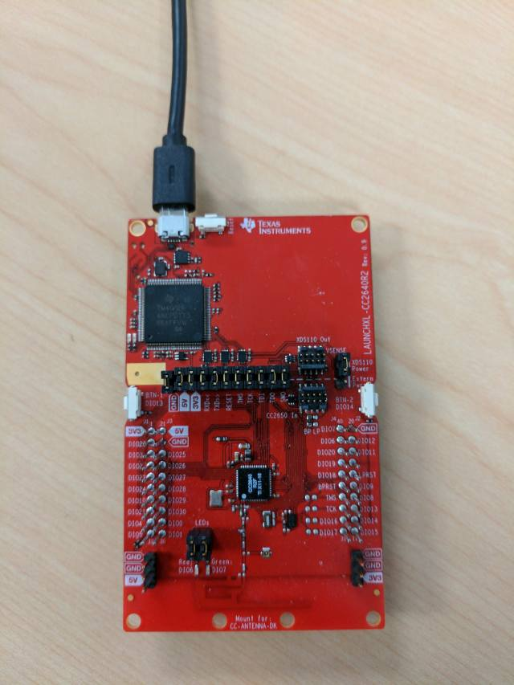

For custom hardware, see the Running the SDK on Custom Boards section of the
[**Bluetooth 4.2 Software User's Guide for CC2640R2F**](http://software-dl.ti.com/lprf/blestack-latest/).

This application also requires a mobile Apple device running iOS that supports
Bluetooth 4.2.

## Software Prerequisites

This project requires either the [**companion GUI Composer application**](https://dev.ti.com/gallery/)
 or a serial terminal application such as [**PuTTY**](http://www.putty.org/)
 or [**Tera Term**](https://ttssh2.osdn.jp/index.html.en) for its demonstrations.

For information on what versions of Code Composer Studio and IAR Embedded
Workbench to use, see the Release Notes located in the docs/blestack folder. For
information on how to import this project into your IDE workspace and
build/run, please refer to the CC2640R2F Platform section in the
 [**Bluetooth 4.2 Software User's Guide for CC2640R2F**](http://software-dl.ti.com/lprf/blestack-latest/).

## Preprocessor Defines

This application has optional functionality toggled in the form of preprocessor
defines. See the BLE-Stack User's guide section for your selected IDE (IAR, CCS)
for more info on how to modify the preprocessor defines
 [**Bluetooth 4.2 Software User's Guide for CC2640R2F**](http://software-dl.ti.com/lprf/blestack-latest/).

#### USE\_GUI\_COMPOSER

This symbol determines which demonstration mode the application is in.
If USE\_GUI\_COMPOSER is defined, the project will support the
[GUI Composer 2.0 demonstration](#gui_composer_demonstration). If instead it is
not defined, the application will support the
[UART demonstration](#uart_demonstration) instead.

By default `USE_GUI_COMPOSER` is defined.

#### USE\_WATCHDOG\_TIMER

This symbol determines if a watchdog timer (WDT) is enabled in the application.
The WDT is enabled when `USE_WATCHDOG_TIMER` is defined, and disabled when the
symbol is undefined. The WDT is set to start counting down once the CC2640R2 is
advertising. The WDT is configured to wait five seconds before being kicked, and
the periodic task resetting the WDT will trigger every half-second. Both of
these values can be changed by adjusting `WATCHDOG_TIMER_TIMEOUT_PERIOD` and
  `ANCSAPP_PERIODIC_EVT_PERIOD` found at the top of ancs_app.c respectfully.

By default `USE_WATCHDOG_TIMER` is undefined.

#### IGNORE\_PREEXISTING\_NOTIFICATIONS

This symbol determines if the application should include notifications
that exist on the mobile Apple device before the session with the CC2640R2 was
initiated. Such notifications are ignored if `IGNORE_PREEXISTING_NOTIFICATIONS`
is defined, conversely preexisting notifications will be processed by the
application if the symbol is undefined.

By default `IGNORE_PREEXISTING_NOTIFICATIONS` is undefined.

## Usage

This application has two primary modes of usage, a GUI Composer 2.0
demonstration, or a UART terminal demonstration.

For both demonstrations, this document will use an iPhone 6 Plus to serve as the
mobile Apple device hosting the ANCS. Note that any mobile Apple device that
supports Bluetooth 4.2 should work accordingly.

### GUI Composer Demonstration

The GUI Composer 2.0 partner application can be accessed
[**Here**](https://dev.ti.com/gallery/). Simply search through the list of
applications featured in the gallery for one titled **ANCS Demo**. Import the
project into GUI Composer.

It may be required to import the ANCS project into GUI composer to change the
COM Port Used by the GUI Composer application, see the screenshot below for
steps.

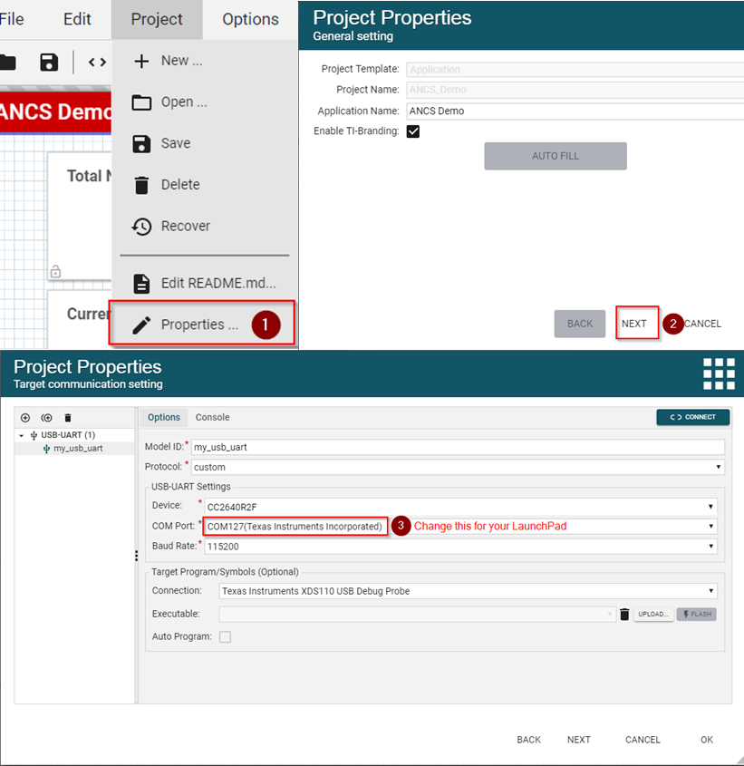

Now the GUI Composer application is configured to use the correct COM port.
Click the play button to run. You should now be presented with this page:

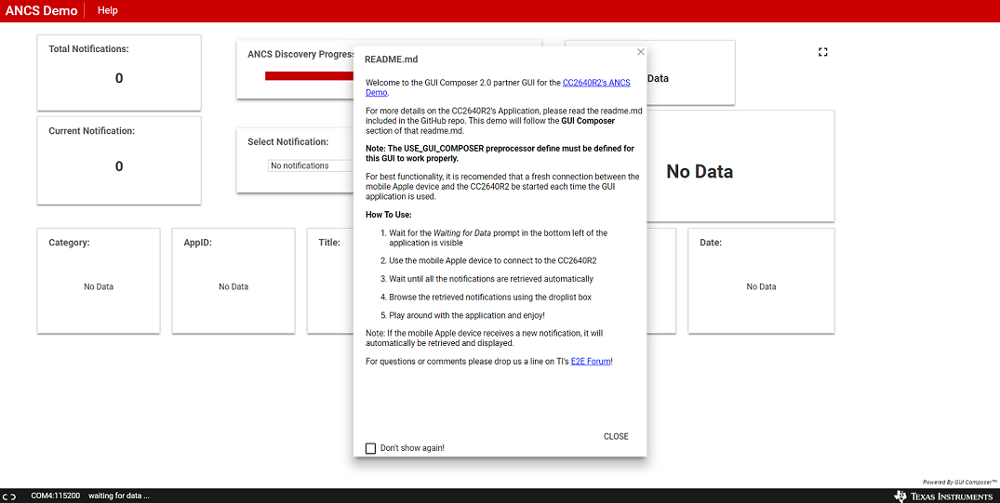

You may click okay **CLOSE** on the README.md window, and wait until the prompt
in the bottom left of the application reads **waiting for data...** as seen in
the above picture.

On the mobile Apple device advertising is enabled by default upon startup, so
there is no need to physically press a button to start advertising. Unlock the
mobile Apple device and open the Settings App. Open the Bluetooth settings tab
and notice that "ANCS Demo" can now be connected to:

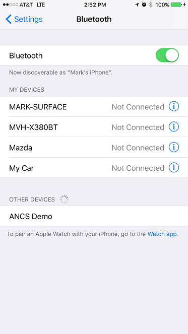

Next, a prompt asking to pair to "ANCS Demo" should appear mobile Apple device:

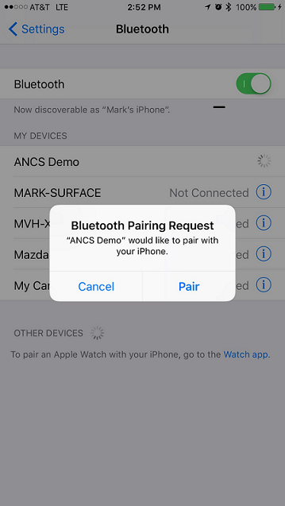

Tap "Pair" and the mobile Apple device should complete the bonding process with
the ANCS Demo. The "ANCS Demo" should now appear with an "i" encompassed by a
circle signifying stored bond data:

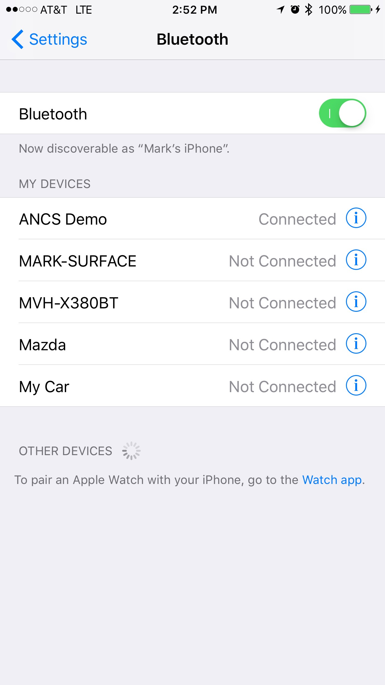

The GUI application should now be displaying various notification data as it is
retrieved:

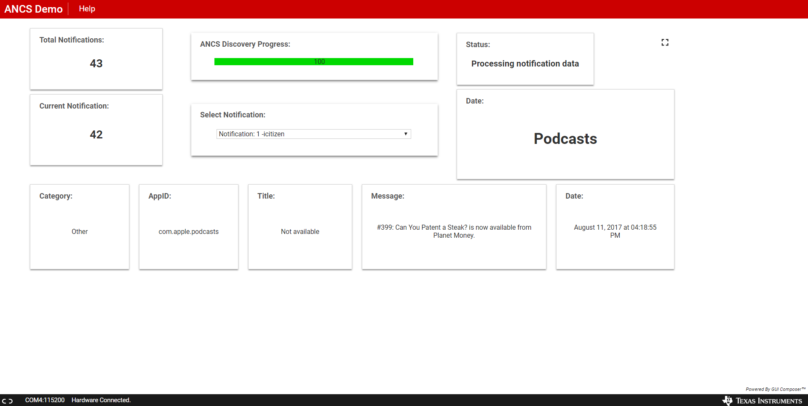

Once notification data is no longer being retrieved for the existing
notifications, you may view retrieved notifications by selecting them in the
droplist box titled **Select Notification:**

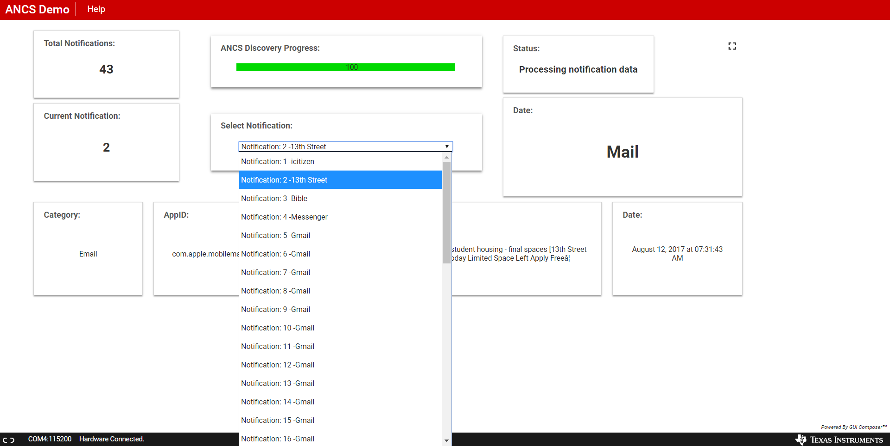

If the mobile Apple device receives an incoming call, you may accept or decline
the call using the CC2640R2's right (Accept) and left (Decline) buttons. This
is an image of the GUI application after accepting a an incoming call:

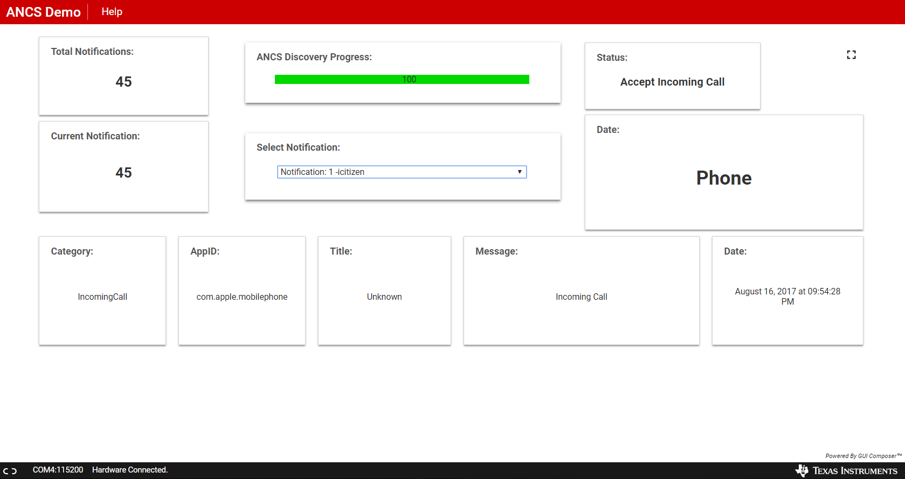

**Note:** If the mobile Apple device generates any new notifications, the ANCS
Demo will automatically retrieve the notification's data and display it
respectively.

## UART Demonstration

This document will use PuTTY to serve as the display for the output of the
CC2640R2 LaunchPad for the UART demonstration. Note that any other serial
terminal application can be used. The following default parameters are used
 for the UART peripheral for display:

  UART Param     |Default Values
  -------------- |----------------
  Baud Rate      |115200
  Data length    |8 bits
  Parity         |None
  Stop bits      |1 bit
  Flow Control   |None

Once the ANCS Demo application starts, the output to the terminal
will report its address and the fact that it is advertising, as shown below:

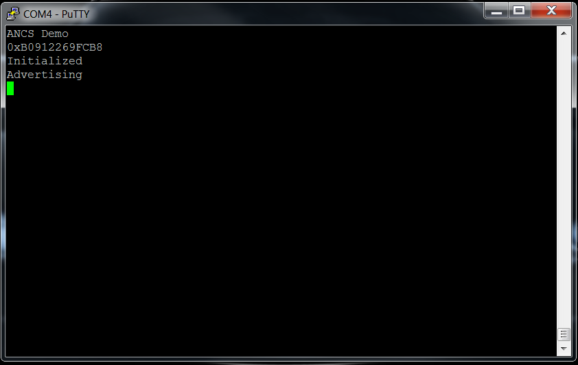

Advertising is enabled by default upon startup, so there is no need to
physically press a button to start advertising. Unlock the mobile Apple device
and open the Settings App. Open the Bluetooth settings tab and notice that
"ANCS Demo" can now be connected to:

Tap "ANCS Demo" to connect to it. The terminal will now display "Connected" and
the address of the connected mobile Apple device as seen below:

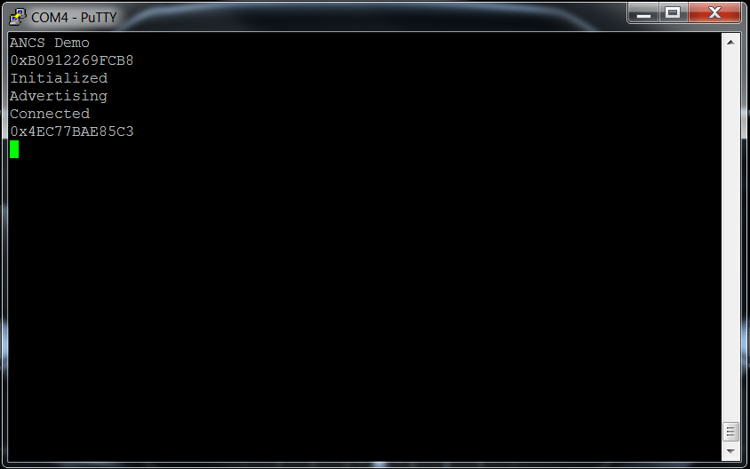

Back on the mobile Apple device a prompt asking to pair to "ANCS Demo" should
appear:

Tap "Pair" and the mobile Apple device should complete the bonding process with
the ANCS Demo. The "ANCS Demo" should now appear with an "i" encompassed by a
circle signifying] stored bond data:

Back on the terminal a stream of notification data should begin to be displayed.
These notifications can be found in the mobile Apple device's Notification
Center.
With each notification seven articles of data will de displayed:

1. The number of notifications left to be processed
2. The category of the notification
3. The iOS application producing the notification's ID
4. The display name of the iOS application
5. The title of the iOS application
6. The message of the notification
7. The date and time the notification was created

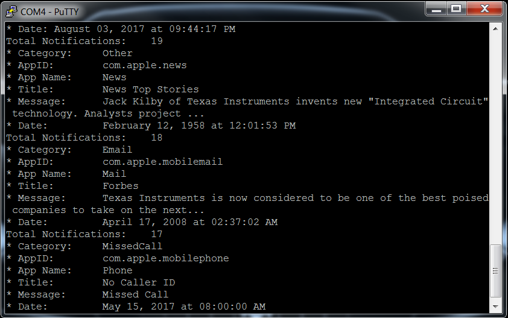

Additionally, if the mobile Apple device receives an incoming call, the call
can be declined by pressing the button on the right side of the device.
Alternatively, the call can be accepted by pressing the button on the left
side of the device.

This is an example UART output of a call being declined:

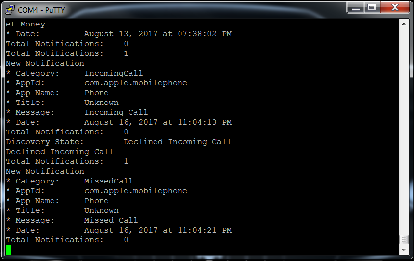

**Note:** If the mobile Apple device generates any new notifications, the ANCS
Demo will automatically retrieve the notification's data and display it
respectively.
