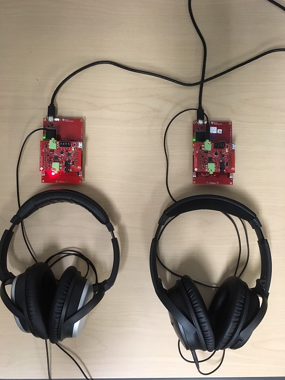

Purpose / Scope
===============

This page will document how to demonstrate an end to end full duplex BLE
voice/audio solution using two CC26xx devices.
Emphasis will be placed on the central device which is responsible for
establishing the connection.

Voice data is transferred over BLE using the TI audio\_profile\_dle which is a
Voice Over GATT Profile (VoGP) design. This profile has been augmented to use
data length extension and large MTU.

This profile has been update to add an additional start byte. This new start
byte indicates that the following stream uses mSBC compression.

In this demo, data flows bidirectionally between a streamer (GATT server) and a
receiver (GATT client) device. This means both devices must act as both a GATT
client and a GATT server.

The `simple_central_bidirectional_audio` project is a modified version of
`simple_central` from the BLE-SDK.

The central project was slightly modified to:

 - Automatically connect to the audio peripheral based on the peripheral's
   advertisement data.
 - Transmit and receive voice streams using the TI VoGP audio\_profile
 - Encode a voice stream from a microphone on the CC3200AUDBOOST.
 - Decode a voice stream and output to headphone/line out on CC3200AUDBOOST.
 - Stream audio data with IMA-ADPCM or mSBC codec using the Data Length
   Extension feature

Streaming Voice over BLE
========================

For more information about the technical details of TI's *Voice Over BLE* Solution
please see the Software Developer's Guide. Note that the audio profile used in
this example is slightly modified to use Data Length extension and large MTU.
[BLE-Stack User's Guide, see Voice Section](http://software-dl.ti.com/lprf/blestack-latest/).

Some quick facts about voice over BLE:

 - `CC3200AUDBOOST boosterpack`
 - Sample rate: `16kHz`
 - Bit Depth: `16 bits`
 - Compression mechanism: `4:1 IMA-ADPCM` or `mSBC`
 - Required application throughput: `66.67kbps` or `60.8kpbs`
 - Voice quality (IMA-ADPCM) has been qualified by Nuance and is sufficient for
   voice recognition solutions


Prerequisites
=============

#### Hardware Requirements

Before running the demo, the user will need the following components:

- Two voice enabled development kits: CC2640R2 LaunchPad with CC3200AUDBOOST
  - [CC2640R2 LaunchPad](http://www.ti.com/tool/launchxl-cc2640r2)
  - [CC3200AUDBOOST](http://www.ti.com/tool/cc3200audboost)
- Two sets of headphones

_Note: Apple headphones will not work with the CC3200 boosterpack_

#### Firmware Requirements

1. Load the peripheral device with the `simple_peripheral_bidirectional_audio`
   project
1. Load the central device with the `simple_central_bidirectional_audio`
   project


Running the Demo
================

#### Hardware Setup

 - Seat the `CC3200AUDBOOST` on the `CC2640R2_LAUNCHXL` as shown in the photo
   below
 - Attach a compatible set of headphones to the `LINE OUT` connector on the
   `CC3200AUDBOOST`



#### Full Duplex Bidirectional Voice Streaming on the CC2640R2

After building the firmware required for the central and peripheral, you are
ready to demo the voice capabilities of the CC2640R2.

1. Power up the peripheral launchpad
 * If the serial port is attached it will log
 ```
  Audio Tx Peripheral with DLE
  <BD_ADDR>
  Initialized
  Advertising
 ```

2. Power up the central device
 * If the serial port is attached it will log
 ```
  Audio Central with DLE
  <BD_ADDR>
  Initialized
  Idle...

 ```
3. Start Discovery on the central device by pressing the left key on the  LaunchPad.
 * The Central device will scan the peripheral's advertisement data for the
   AUDIO\_SERV\_UUID (Audio Profile).
 * After finding devices that list these services, their advertisement payloads
   will be scanned for the device name:

 ```c
  static uint8 remoteNameTx[] =
  {
      'S', 'i', 'm', 'p', 'l', 'e',
      'B', 'L', 'E',
      'A', 'u', 'd', 'i', 'o', 'T', 'x',
  };
 ```
4. If an acceptable voice streaming device is found (CC2640R2LP with the correct
   name and audio profile), the central will connect, pair, and bond to the device.
   If attached, the serial port will log:
 * Audio Central
  ```
  Discovering...
  Pairing started
  Connected
  <PEER_BD_ADDR>
  ```
 * Audio Peripheral
  ```
  Connected
  <PEER_BD_ADDR>
  ```
5. The devices are now ready to stream voice over BLE.
  * Press the right button on the peripheral device to start streaming with
    ADPCM compression.
  * Press the left button on the peripheral device to start streaming with mSBC
    compression
  * Press both buttons on the peripheral device simultaneously to stop the stream.

6. The demo is written such that, once an audio peripheral is discovered, the
audio\_central project will pair and bond to it. Scanning/connecting to other
devices is not allowed while **bonded**. (I.e. left button is disabled).
In order to "forget the devices" you should:
 * Power off your audio peripheral device. Wait for link to be terminated. Red LED will turn on on the central device.
 * Press the right button on the central device to erase the bonds from the audio\_peripheral project. Green LED will blink one time while the red LED stays on.
 * The bonds are now erased, you can discover and connect to another device.


Demo LED states
===============

The following states of the device can be described by the red and green LEDs on the LaunchPad.
* Idle + bonds forgotten: Red LED is on, solid
* Scanning for devices: Green LED is flashing
* Device connected + bond saved: Green LED is on, solid
* Device connected and bonded + streaming voice: Red LED blinks on both LP and STK or Remote.
* Bonds forgotten: Green LED blinks 1x while red LED is on.

References
==========
 * [BLE-Stack User's Guide, see Voice Section](http://software-dl.ti.com/lprf/blestack-latest/)
