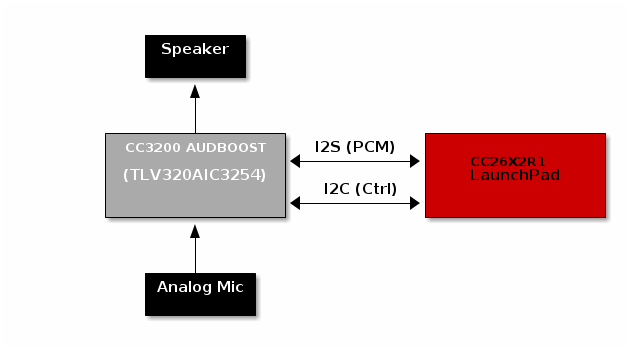

Purpose / Scope
===============

This page will document how to demonstrate an end to end full duplex BLE
voice/audio solution using two CC26x2 devices.

Voice data is transferred over BLE using the TI audio\_profile\_dle which is a
Voice Over GATT Profile (VoGP) design. This profile has been augmented to use
data length extension and large MTU.

The TI audio\_profile\_dle has been updated to add an additional start byte.
This new start byte indicates that the following stream uses mSBC compression.

In this demo, data flows bidirectionally between a transmitter (GATT server) and
a receiver (GATT client) device. This means both devices must act as both a GATT
client and a GATT server.

The `central_bidirectional_audio` project is a modified version of
`simple_central` from the BLE5-Stack component of the CC26x2 SDK.

The central project was slightly modified to:

 - Automatically connect to the audio peripheral based on the peripheral's
   advertisement data.
 - Transmit and receive voice streams using the TI VoGP audio\_profile\_dle
 - Encode a voice stream from a microphone/line in on the CC3200AUDBOOST.
 - Decode a voice stream and output to headphone/line out on CC3200AUDBOOST.
 - Stream audio data with IMA-ADPCM or mSBC codec using the Data Length
   Extension feature

Streaming Voice over BLE
========================

Some quick facts about voice over BLE:

 - `CC3200AUDBOOST BoosterPack`
 - Sample rate: `16kHz`
 - Bit Depth: `16 bits`
 - Compression mechanism: `4:1 IMA-ADPCM` or `mSBC`
 - Required application throughput: `66.67kbps` or `60.8kpbs`
 - Voice quality (IMA-ADPCM) has been qualified by Nuance and is sufficient for
   voice recognition solutions

_Note: The files in source/ti/audiocodec are used as the control interface to
the TLV320AIC3254 on the CC3200AUDBOOST. The software codecs responsible for
compression and decompression are found in the following locations:_
 - MSBC: source/third_party/sbc (of this repo)
 - ADPCM: source/ti/drivers/pdm (of the SDK install)

Platform Overview/Comparison
============================

The bidirectional audio demo borrows several components from TI's existing
voice ecosystem (CC2640R2/CC2650 HID Advanced Remote, CC2650 SensorTag).
However, it also differs in some ways. This section will highlight the
important similarities and differences.

| Example                              | Streaming method | Input method                               | Output method               | S/W Compression Supported | Sample Rate | Frame Size | Notifications per Frame |
|--------------------------------------|------------------|--------------------------------------------|-----------------------------|---------------------------|-------------|------------|-------------------------|
| Bidirectional Audio                  | bidirectional    | Analog mic + external codec                | external codec + headphones | mSBC, ADPCM               | 16kHz       | 100 Octets | 1                       |
| HID Advanced Remote, SensorTag Voice | unidirectional   | Digit mic + pulse density modulation (PDM) | None                        | ADPCM                     | 16kHz       | 100 Octets | 5                       |

The Voice chapter of the BLE-Stack User's Guide describes the voice ecosystem
employed by the the HID Advanced Remote and SensorTag voice projects.
[BLE-Stack User's Guide, see Voice Section](http://software-dl.ti.com/lprf/blestack-latest/).
This is good prerequiste reading before continuing with this guide.
**Note: The bidirectional audio differs from the HID Advanced Remote/SensorTag
voice projects in some key ways, the differences are summarized in the table
above and discused in depth in the sections below.**

Input/Output
------------

The bidirectional audio projects take a different approach to audio sampling
than the remote control/ SensorTag projects.
Instead of sampling digital audio using PDM, an external codec chip
(TLV320AIC3254) is connected to the CC26x2 via I2S. The samples from the
TLV320AIC3254 are in PCM format. A block diagram is shown below



Software Compression
--------------------

In addition to the 4:1 IMA-ADPCM compression format supported by the
HID Advanced Remote and SensorTag projects, the bidirectional audio demo
supports mSBC.

mSBC is known for its inclusion in the Bluetooth Classic
[Hands-Free Profile (HFP)](https://www.bluetooth.com/specifications/profiles-overview)

mSBC is a specific configuration of the Subband Codec (SBC) that is defined in
appendix B of the [A2DP](https://www.bluetooth.com/specifications/profiles-overview)
specification.

TI has adapted the open source of implementation of SBC from
[BlueZ](http://www.bluez.org/sbc-13/) to run on CC26x2 in single channel mSBC
only format.

TI has also added a new start byte to the TI Audio Profile to differentiate
between mSBC and ADPCM streams, this is discussed further in the next section.

Audio Profile Changes
---------------------

There are two major updates in the audio profile when comparing to the one
used by the HID Advanced Remote and the SensorTag:

 - `START_MSBC` A new start command indicating an mSBC stream
 - Support for large MTU, Data Length Extension: audio frames are now sent in a
   single packet

### mSBC Start Command

The intent of the new start command is for the demo to differentiate between
the start of a stream of ADPCM compressed data and mSBC compressed data.
The value of the new command is 0x05. The existing start command (0x04) is
interpreted to signify ADPCM streams.

### Increased packet size

The bidirectional audio demo takes advantage Bluetooth 4.2 features by using
a large GATT MTU and data length extension. This allows the entire audio frame
to be sent in a single packet over the air. By not having to fragment audio
frames across multiple packets the protocol overhead of sending a single
frame is reduced.

Per the voice chapter of the [BLE-Stack User's Guide](http://software-dl.ti.com/lprf/blestack-latest/)
each audio frame is 100 octets long containing 96 bytes of audio data and 4 bytes
of metadata.

Previously the HID Advanced Remote and SensorTag audio projects would fragment
these frames across 5 notifications. Each notification has an overhead of
7 bytes of protocol headers (4B L2CAP, 3B GATT). The bidirectional audio demo
will use a large GATT MTU to send the entire audio frame in a single notification.

Therefore in order to support sending an audio frame in a single packet
the following define must exist in each audio project: `-DMAX_PDU_SIZE=107`
Furthermore, an MTU exchange must be performed before audio streaming starts.
The negotiated MTU must be >= 103 bytes. The MTU does not include
the L2CAP headers which is why it differents from the `MAX_PDU_SIZE` by 4 bytes.

In addition to the large MTU used by the bidirectional audio projects, each
project is configured to use LE Data Length Extension. This means that the
LE controller is configured to send an entire frame in a single PDU, and no
fragmentation will occur in the controller either.

At this time the bidirectional audio demo does not support receiving streams
from the SensorTag or HID Advanced Remote projects.

### PHY Support

On CC26x2 only, the bidirectional audio demos have been enhanced to support
Bluetooth 5 PHYs including Coded S=2, and 2Mbps. The preferred PHY can be
configured before the connection is established.


Runtime Buffer Management
=========================

During normal operation the instruction cache is enabled.

When bidirectional streaming begins, the cache is disabled and is temporarily used
as RAM for I2S buffers. Once the stream stops, the instruction cache is re-enabled.

This offers significant power consumption improvements over a `CACHE_AS_RAM`
configuration.

Prerequisites
=============

#### Hardware Requirements

Before running the demo, the user will need the following components:

- Two voice enabled development kits: CC26x2 LaunchPad with CC3200AUDBOOST
  - [CC26X2R1 LaunchPad](http://www.ti.com/tool/LAUNCHXL-CC26X2R1)
  - [CC3200AUDBOOST](http://www.ti.com/tool/cc3200audboost)
- Two sets of headphones

_Note: Apple headphones will not work with the CC3200 BoosterPack_

#### Codec requirements

The CC3200 Audio BoosterPack includes a TLV320AIC3254 audio codec,
this is a premium high performance model with many optional features.
However, most of these features are not required for the demo.
When selecting a codec for production hardware, this demo requires the
following minimum specifications:

- 1x ADC
- 1x DAC
- 1x bidirectional I2S port (Din, Dout)
- 1x I2C control port

Features such as the miniDSP, headphone amp, and speaker amp are optional
and may or may not be needed for a given use case.

#### Firmware Requirements

1. Load the peripheral device with the `peripheral_bidirectional_audio`
   project
2. Load the central device with the `central_bidirectional_audio`
   project


Running the Demo
================

#### Hardware Setup

 - Seat the `CC3200AUDBOOST` on the `CC26X2R1_LAUNCHXL` as shown in the photo
   below
 - Attach a compatible set of headphones to the `LINE OUT` connector on the
   `CC3200AUDBOOST`


**Note: The setup below shows two CC2640R2 LaunchPads, the setup is the same
for CC26x2R1 LaunchPad**

#### Full Duplex Bidirectional Voice Streaming on the CC26x2

After building the firmware required for the central and peripheral, you are
ready to demo the voice capabilities of the CC26x2.

1. Power up the peripheral LaunchPad
 * If the serial port is attached it will log, however it is not necessary to
   use the display for this demo

  ```
  *Peripheral Bidirectional Audio

   +Audio Codec Config >


  ====================
  Initialized


  Adv Set 1 Enabled

  Dev Addr: <BD_ADDR>
  ```

2. Power up the central LaunchPad

 ```
  *Central Bidirectional Audio
  < Next Item
    Start scanning >
   +Audio Codec Config
  ====================
  Dev Addr: <BD_ADDR>
  Num Conns: 0

 ```

3. (Optional) If desired, change the audio input/ouput configuration my
   navigating to the menu item titled *Audio Codec Config*. The audio IO
   settings must be changed before entering a connection and cannot be changed
   during an active stream. These settings can also be changed on the peripheral
   side. See [Changing Audio IO Config](#changing-audio-io-config) section for
   details.

4. Press the right key with the *Start Scanning* menu item connected to
   scan for and connect to peripheral audio devices.
 * The Central device will scan the peripheral's advertisement data for the
   AUDIO\_SERV\_UUID (Audio Profile).

5. If an acceptable voice streaming device is found (CC26x2LP with the correct
   name and audio profile), the central will connect to the device and discover
   the audio service. The red LED should be turned off, and the green LED
   should be turned on once connected with complete discovery.
   If attached, the serial port will log:

 * Audio Central
  ```
  *Central Bidirectional Audio

   +Audio Stream Options >

  ====================
  Dev Addr: <BD_ADDR>
  Num Conns: 1
  Connected to <PEER_BD_ADDR>
  Audio Service Discovery Complete on connIdx 0
  ```
 * Audio Peripheral
  ```
  *Peripheral Bidirectional Audio


  ====================
  MTU Size: 103
  Num Conns: 1

  Adv Set 1 Disabled

  Dev Addr: <BD_ADDR>


  Audio Service Discovery Complete
  ```
6. The devices are now ready to stream voice over BLE. Press the right
   button on the central LaunchPad to enter the *Audio Stream Options* submenu.

7. Once inside the *Audio Stream Options* submenu, press the right button to
   select one of the following streaming options:
  * Press right button on *Start Streaming: ADPCM* to stream ADPCM compressed
    audio.
  * Press the left button to select the next menu item, followed by the right
    button to select the *Start Streaming: mSBC* menu item. This will stream
    mSBC compressed audio.

Demo LED states
===============

The following states of the device can be described by the red and green LEDs
on the LaunchPad running the `central_bidirectional_audio` demo. The LaunchPad
running the peripheral will have no LED output.

* Idle: Red LED is on, solid
* Scanning for devices: Green LED is flashing
* Device connected: Green LED is on, solid

Changing Audio IO Config
========================

You can use the menu system to change the audio input/output configuration
on the fly. However, these must be configured before audio streaming starts.
Once audio streaming starts, the configuration is locked until streaming stops.

The support options are:

### Input


 - MIC_ONBOARD: use the microphone on the CC3200_AUDBOOST
 - LINE_IN: Use an input device connected to LINE_IN connector on
   CC3200_AUDBOOST

### Output

 - LINE_OUT: Sound is routed to LINE_OUT connector on the CC3200_AUDBOOST,
             line level
 - HEADPHONE: Sound is routed to LINE_OUT connector, headphone level

References
==========
 * [BLE-Stack User's Guide, see Voice Section](http://software-dl.ti.com/lprf/blestack-latest/)
