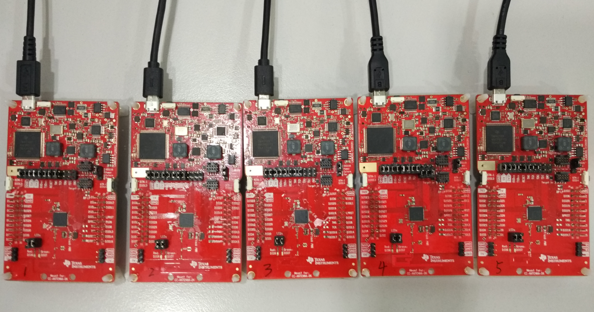
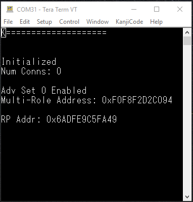
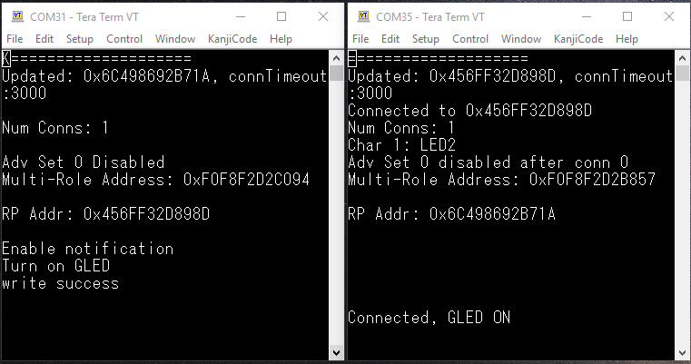
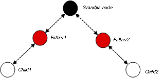
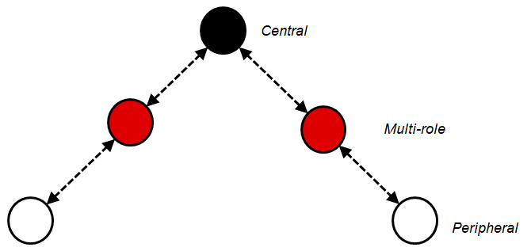
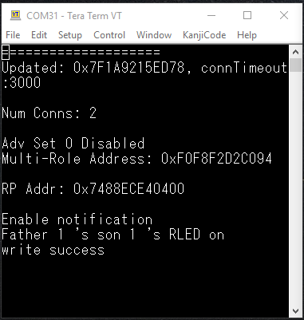
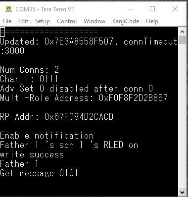
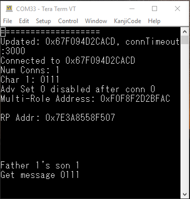
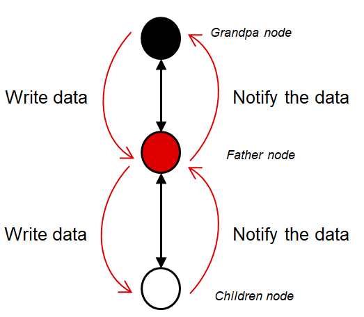

Introduction
============

The tree_structure_network project demonstrates the capabilities of the Texas 
Instruments BLE stack to function in Bluetooth® Low energy Tree Structure 
network. Technical aspects of this example are described in the accompanied app 
note. Please see: [Bluetooth® Low Energy Tree Structure Network](www.ti.com/lit/swra648)

This example project is capable of functioning as a grandfather 
node, a father node and a child node in any combination, while 
maintaining several connections (up to the amount of connections defined by 
MAX_NUM_BLE_CONNS). The project is capable of connecting to any role in tree 
structure network. The role will be defined according to the connection sequence 
(e.g. the first nod to connect as a master will become the grandpa node). The 
project supports multiple simultaneous GATT discoveries. This project has the 
following app build configurations available:

| Build Configuration        | Description                                                                                                                                                                                         |
|----------------------------|-----------------------------------------------------------------------------------------------------------------------------------------------------------------------------------------------------|
| FlashROM_Release (default) | All TI-RTOS debug features disabled but application-logging to UART remains enabled. The application uses the config file ble_release.cfg and the defines are in <app name>\_FlashROM\_Release.opt. |
| FlashROM_Debug             | All TI-RTOS debug features enabled. The application uses the config file ble_debug.cfg and the defines are in <app name>\_FlashROM\_Debug.opt.                                                      |

All application configurations use the stack library configuration, 
FlashROM_Library. This build configuration will yield additional flash footprint 
optimizations by the linker since the application and stack can share contiguous 
flash pages. This configuration is further discussed in the Stack Library 
Configuration section of the BLE5-Stack User’s Guide provided in the SDK.

Hardware Prerequisites
======================

The default Tree Structure Network board configuration uses the CC26x2R1 
LaunchPad development kit. This hardware configuration is shown in the below 
image:



For custom hardware, see the Running the SDK on Custom Boards section of the 
BLE5-Stack User’s Guide.

Software Prerequisites
======================

For information on what versions of Code Composer Studio and IAR Embedded 
Workbench to use, see the Release Notes file provided in the SDK. For 
information on how to import this project into your IDE workspace and build/run 
it, please refer to the device’s Platform section in the BLE5-Stack User’s Guide.

Assumptions/Considerations
==========================

Once the connection limit (set with the MAX_NUM_BLE_CONNS preprocessor define) 
is reached, the grandfather device and father device won’t be allowed to scan 
until there is a disconnection.

By default, the tree_structure_network application is configured to filter and 
connect to peripheral devices with the TI Tree Structure Service UUID.

If the project is configured for a large number of connections (via the 
MAX_NUM_BLE_CONNS preprocessor define) and also security (pairing/bonding), it 
is possible for heap allocation failures to occur which will break the stack. 
Therefore, the project should be stress-tested for its intended use case to verify 
that there are no heap issues by including the HEAPMGR_METRICS preprocessor 
define. See the Debugging section of the BLE5-Stack User’s Guide for more 
information on how to do this.

When at least one connection is already formed, in order to allow enough 
processing time to scan for a new connection, the minimum possible connection 
interval (in milliseconds) that can be used is:

12.5 + 5\*n

where n is the amount of current connections. For example, if there are currently 
four connections, all four connections must use a minimum connection interval of 
12\*5 + 5\*4 = 32.5 ms in order to allow scanning to occur to establish a new 
connection.

Usage
=====

The tree_structure_network project uses the two buttons on the LaunchPad to 
accept user input and outputs information through the UART. The UART is only 
used for display messages. This document will use a terminal program (Tera Term, 
PuTTY, etc.) to serve as the display for the output of the LaunchPad. Note that 
any other serial terminal can be used. The following default parameters are used 
for the UART peripheral for display:

| UART Param   | Default Values |
|--------------|----------------|
| Baud Rate    | 115200         |
| Data length  | 8 bits         |
| Parity       | None           |
| Stop bits    | 1 bit          |
| Flow Control | None           |

Upon powering on or resetting the device, the user will see the default board 
message. (RP address refers to resolvable private address.)



In certain cases, the user may want to switch from a "menu view" to a "log view" 
(i.e. each new message is printed on the next line). In order to achieve this, 
open the compiler predefined symbols list (`.opt` file) and set the following 
define to zero:

`-DBOARD_DISPLAY_USE_UART_ANSI=0`

Establish the First Connection
==============================

Program all devices that will be a part of the the network with the tree network 
structure example project.

Click the right button on the intended grandpa node. The device will discover 
other devices. If other devices are discovered, it will connect this device, then 
enable the connected device’s notification function, and send the command to turn 
on the green LED automatically. (In the image, the grandfather device display is 
shown on the left and the father1 device display on the right.)



Establish the Tree Structure Network
====================================

Now the grandfather board is connected  to the the father1 board. Then turn on 
the power of father2, click the right button on grandfather board to connect the 
father2 board. Then follow the same way to use father1 board to connect the 
child1 board, and father2 board to connect the child2 board.



GAP Role Information
====================

For grandpa node, it is always central role. For children nodes, they are always 
peripheral role. For father node, when it is connected by grandpa node, it will 
be central role first. And after it connects to children node, it will be 
peripheral node. So father node GAP role changes when the connection and is thus 
defined as multi-role.



Grandfather Node Writing
========================

After establishing the tree structure network, the option to write and notify 
will now become available. In this option, pressing the left button on the 
grandfather board once will enable grandfather node to write data to all father 
nodes and children nodes defined in chalVals array. (If the data is intended to 
a child node, the father node will forward it automatically.) Note that when the 
message is received in each father and child node, their red led will be set or 
reset in order according to the message. When this happens the green led will 
automatically turn off.







Grandfather node’s operation in tree type network is defined in the charVals 
table. See details below.

```
//Char value table length
#define string_index_max 8

//Send char value table
uint8_t charVals[string_index_max][TREENETWORKSERVICE_CHAR1_LEN] = { 
                            {'0', '1', '0', '0', '\0'}, //Father 1 led off
                            {'0', '1', '1', '0', '\0'}, //Father 1's child 1 led off
                            {'0', '2', '0', '0', '\0'}, //Father 2 led off
                            {'0', '2', '1', '0', '\0'}, //Father 2's child 1 led off
                            {'0', '1', '0', '1', '\0'}, //Father 1 led on
                            {'0', '1', '1', '1', '\0'}, //Father 1's child 1 led on
                            {'0', '2', '0', '1', '\0'}, //Father 2 led on
                            {'0', '2', '1', '1', '\0'}  //Father 2's child 1 led on
                            // Reserved
                                  // Father index
                                       // Father branch elements (child index)
                                            // Led ON/OFF
                            }; // Should be consistent with those in GattWrite
```

Child Node Notification
=======================

After the network has been established, pressing the left button on a father 
board or a child board once will enable the node to send a message that this 
happened to the grandpa node (by GATT notification). The following shows the 
successful message on the grandpa node of the key pressing message. 


Data Transmission Flow and Data Format
=============================================================



Data packets are sent as GATT write or GATT notification packets. The data format 
is given below:

| Array index |     0    |          1          |           2           |      3     |
|-------------|:--------:|:-------------------:|:---------------------:|:----------:|
| Meaning     | Reserved | Father branch index | Children branch index | Led status |